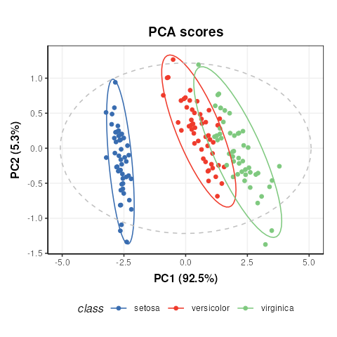
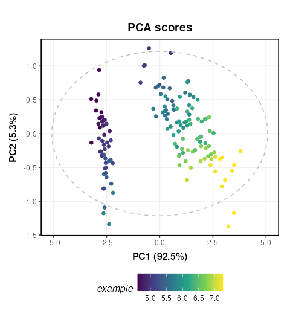
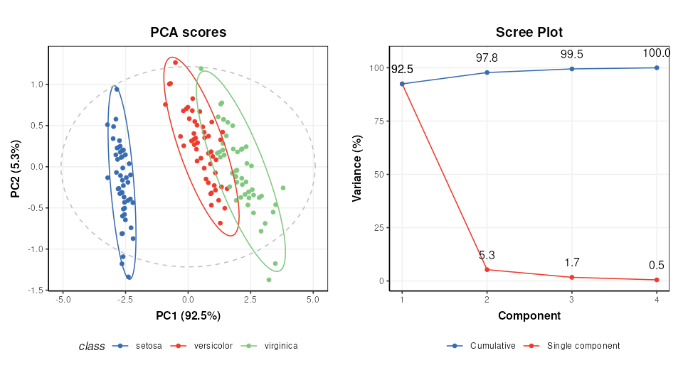
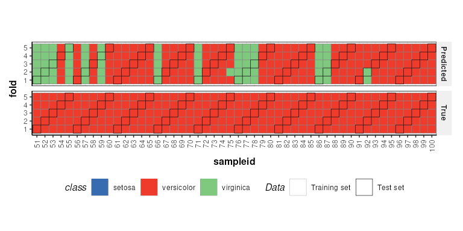

# Introduction to 'struct' objects

## Introduction to `struct` objects, including models, model sequences, model charts and ontology.

### Introduction

PCA (Principal Component Analysis) and PLS (Partial Least Squares) are
commonly applied methods for exploring and analysing multivariate
datasets. Here we use these two statistical methods to demonstrate the
different types of `struct` (STatistics in R Using Class Templates)
objects that are available as part of the `structToolbox` and how these
objects (i.e. class templates) can be used to conduct unsupervised and
supervised multivariate statistical analysis.

### Dataset

For demonstration purposes we will use the “Iris” dataset. This famous
(Fisher’s or Anderson’s) dataset contains measurements of sepal length
and width and petal length and width, in centimeters, for 50 flowers
from each of 3 class of Iris. The class are Iris setosa, versicolor, and
virginica. See here
(<https://stat.ethz.ch/R-manual/R-devel/library/datasets/html/iris.html>)
for more information.

Note: this vignette is also compatible with the Direct infusion mass
spectrometry metabolomics “benchmark” dataset described in Kirwan et
al., *Sci Data* *1*, 140012 (2014)
(<https://doi.org/10.1038/sdata.2014.12>).

Both datasets are available as part of the structToolbox package and
already prepared as a `DatasetExperiment` object.

``` r

## Iris dataset (comment if using MTBLS79 benchmark data)
D = iris_DatasetExperiment()
D$sample_meta$class = D$sample_meta$Species

## MTBLS (comment if using Iris data)
# D = MTBLS79_DatasetExperiment(filtered=TRUE)
# M = pqn_norm(qc_label='QC',factor_name='sample_type') + 
#   knn_impute(neighbours=5) +
#   glog_transform(qc_label='QC',factor_name='sample_type') +
#   filter_smeta(mode='exclude',levels='QC',factor_name='sample_type')
# M = model_apply(M,D)
# D = predicted(M)

# show info
D
```

    ## A "DatasetExperiment" object
    ## ----------------------------
    ## name:          Fisher's Iris dataset
    ## description:   This famous (Fisher's or Anderson's) iris data set gives the measurements in centimeters of
    ##                  the variables sepal length and width and petal length and width,
    ##                  respectively, for 50 flowers from each of 3 species of iris. The species are
    ##                  Iris setosa, versicolor, and virginica.
    ## data:          150 rows x 4 columns
    ## sample_meta:   150 rows x 2 columns
    ## variable_meta: 4 rows x 1 columns

#### DatasetExperiment objects

The `DatasetExperiment` object is an extension of the
`SummarizedExperiment` class used by the Bioconductor community. It
contains three main parts:

1.  `data` A data frame containing the measured data for each sample.
2.  `sample_meta` A data frame of additional information related to the
    samples e.g. group labels.
3.  `variable_meta` A data frame of additional information related to
    the variables (features) e.g. annotations

Like all `struct` objects it also contains `name` and `description`
fields (called “slots” is R language).

A key difference between `DatasetExperiment` and `SummarizedExperiment`
objects is that the data is transposed. i.e. for `DatasetExperiment`
objects the samples are in rows and the features are in columns, while
the opposite is true for `SummarizedExperiment` objects.

All slots are accessible using dollar notation.

``` r

# show some data
head(D$data[,1:4])
```

    ##   Sepal.Length Sepal.Width Petal.Length Petal.Width
    ## 1          5.1         3.5          1.4         0.2
    ## 2          4.9         3.0          1.4         0.2
    ## 3          4.7         3.2          1.3         0.2
    ## 4          4.6         3.1          1.5         0.2
    ## 5          5.0         3.6          1.4         0.2
    ## 6          5.4         3.9          1.7         0.4

### Using `struct` model objects

#### Statistical models

Before we can apply e.g. PCA we first need to create a PCA object. This
object contains all the inputs, outputs and methods needed to apply PCA.
We can set parameters such as the number of components when the PCA
model is created, but we can also use dollar notation to change/view it
later.

``` r

P = PCA(number_components=15)
P$number_components=5
P$number_components
```

    ## [1] 5

The inputs for a model can be listed using `param_ids(object)`:

``` r

param_ids(P)
```

    ## [1] "number_components"

Or a summary of the object can be printed to the console:

``` r

P
```

    ## A "PCA" object
    ## --------------
    ## name:          Principal Component Analysis (PCA)
    ## description:   PCA is a multivariate data reduction technique. It summarises the data in a smaller number of
    ##                  Principal Components that maximise variance.
    ## input params:  number_components 
    ## outputs:       scores, loadings, eigenvalues, ssx, correlation, that 
    ## predicted:     that
    ## seq_in:        data

#### Model sequences

Unless you have good reason not to, it is usually sensible to mean
centre the columns of the data before PCA. Using the `STRUCT` framework
we can create a model sequence that will mean centre and then apply PCA
to the mean centred data.

``` r

M = mean_centre() + PCA(number_components = 4)
```

In `structToolbox` mean centring and PCA are both model objects, and
joining them using “+” creates a model_sequence object. In a
model_sequence the outputs of the first object (mean centring) are
automatically passed to the inputs of the second object (PCA), which
allows you chain together modelling steps in order to build a workflow.

The objects in the model_sequence can be accessed by indexing, and we
can combine this with dollar notation. For example, the PCA object is
the second object in our sequence and we can access the number of
components as follows:

``` r

M[2]$number_components
```

    ## [1] 4

#### Training/testing models

Model and model_sequence objects need to be trained using data in the
form of a `DatasetExperiment` object. For example, the PCA model
sequence we created (`M`) can be trained using the iris
`DatasetExperiment` object (‘D’).

``` r

M = model_train(M,D)
```

This model sequence has now mean centred the original data and
calculated the PCA scores and loadings.

Model objects can be used to generate predictions for test datasets. For
the PCA model sequence this involves mean centring the test data using
the mean of training data, and the projecting the centred test data onto
the PCA model using the loadings. The outputs are all stored in the
model sequence and can be accessed using dollar notation. For this
example we will just use the training data again (sometimes called
autoprediction), which for PCA allows us to explore the training data in
more detail.

``` r

M = model_predict(M,D)
```

Sometimes models don’t make use the training/test approach
e.g. univariate statsitics, filtering etc. For these models the
`model_apply` method can be used instead. For models that do provide
training/test methods, `model_apply` applies autoprediction by default
i.e. it is a short-cut for applying `model_train` and `model_predict` to
the same data.

``` r

M = model_apply(M,D)
```

The available outputs for an object can be listed and accessed like
input params, using dollar notation:

``` r

output_ids(M[2])
```

    ## [1] "scores"      "loadings"    "eigenvalues" "ssx"         "correlation"
    ## [6] "that"

``` r

M[2]$scores
```

    ## A "DatasetExperiment" object
    ## ----------------------------
    ## name:          
    ## description:   
    ## data:          150 rows x 4 columns
    ## sample_meta:   150 rows x 2 columns
    ## variable_meta: 4 rows x 1 columns

#### Model charts

The `struct` framework includes chart objects. Charts associated with a
model object can be listed.

``` r

chart_names(M[2])
```

    ## [1] "pca_biplot"           "pca_correlation_plot" "pca_dstat_plot"      
    ## [4] "pca_loadings_plot"    "pca_scores_plot"      "pca_scree_plot"

Like model objects, chart objects need to be created before they can be
used. Here we will plot the PCA scores plot for our mean centred PCA
model.

``` r

C = pca_scores_plot(factor_name='class') # colour by class
chart_plot(C,M[2])
```



Note that indexing the PCA model is required because the
`pca_scores_plot` object requires a PCA object as input, not a
model_sequence.

If we make changes to the input parameters of the chart, `chart_plot`
must be called again to see the effects.

``` r

# add petal width to meta data of pca scores
M[2]$scores$sample_meta$example=D$data[,1]
# update plot
C$factor_name='example'
chart_plot(C,M[2])
```



The `chart_plot` method returns a ggplot object so that you can easily
combine it with other plots using the `gridExtra` or `cowplot` packages
for example.

``` r

# scores plot
C1 = pca_scores_plot(factor_name='class') # colour by class
g1 = chart_plot(C1,M[2])

# scree plot
C2 = pca_scree_plot()
g2 = chart_plot(C2,M[2])

# arange in grid
grid.arrange(grobs=list(g1,g2),nrow=1)
```



#### Ontology

Within the `struct` framework (and `structToolbox`) an `ontology` slot
is provided to allow for standardardised definitions for objects and its
inputs and outputs using the Ontology Lookup Service (OLS).

For example, STATO is a general purpose STATistics Ontology
(<http://stato-ontology.org>). From the webpage:

> Its aim is to provide coverage for processes such as statistical
> tests, their conditions of application, and information needed or
> resulting from statistical methods, such as probability distributions,
> variables, spread and variation metrics. STATO also covers aspects of
> experimental design and description of plots and graphical
> representations commonly used to provide visual cues of data
> distribution or layout and to assist review of the results.

The ontology for an object can be set by assigning the ontology term
identifier to the ontology slot of any `struct_class` object at design
time. The ids can be listed using `$` notation:

``` r

# create an example PCA object
P=PCA()

# ontology for the PCA object
P$ontology
```

    ## [1] "OBI:0200051"

The `ontology` method can be used obtain more detailed ontology
information. When `cache = NULL` the `struct` package will automatically
attempt to use the OLS API (via the `rols` package) to obtain a name and
description for the provided identifiers. Here we used cached versions
of the ontology definitions provided in the `structToolbox` package to
prevent issues connecting to the OLS API when building the package.

``` r

ontology(P,cache = ontology_cache()) # set cache = NULL (default) for online use
```

    ## [[1]]
    ## An object of class "ontology_list"
    ## Slot "terms":
    ## [[1]]
    ## term id:       OBI:0200051
    ## ontology:      obi
    ## label:         principal components analysis dimensionality reduction
    ## description:   A principal components analysis dimensionality reduction is a dimensionality reduction
    ##                  achieved by applying principal components analysis and by keeping low-order principal
    ##                  components and excluding higher-order ones.
    ## iri:           http://purl.obolibrary.org/obo/OBI_0200051
    ## 
    ## 
    ## 
    ## [[2]]
    ## An object of class "ontology_list"
    ## Slot "terms":
    ## [[1]]
    ## term id:       STATO:0000555
    ## ontology:      stato
    ## label:         number of predictive components
    ## description:   number of predictive components is a count used as input to the principle component analysis
    ##                  (PCA)
    ## iri:           http://purl.obolibrary.org/obo/STATO_0000555

Note that the `ontology` method returns definitions for the object (PCA)
and the inputs/outputs (number_of_components).

### Validating supervised statistical models

Validation is an important aspect of chemometric modelling. The `struct`
framework enables this kind of iterative model testing through
`iterator` objects.

#### Cross-validation

Cross validation is a common technique for assessing the performance of
classification models. For this example we will use a Partial least
squares-discriminant analysis (PLS-DA) model. Data should be mean
centred prior to PLS, so we will build a model sequence first.

``` r

M = mean_centre() + PLSDA(number_components=2,factor_name='class')
M
```

    ## A model_seq object containing:
    ## 
    ## [1]
    ## A "mean_centre" object
    ## ----------------------
    ## name:          Mean centre
    ## description:   The mean sample is subtracted from all samples in the data matrix. The features in the centred
    ##                  matrix all have zero mean.
    ## input params:  mode 
    ## outputs:       centred, mean_data, mean_sample_meta 
    ## predicted:     centred
    ## seq_in:        data
    ## 
    ## [2]
    ## A "PLSDA" object
    ## ----------------
    ## name:          Partial least squares discriminant analysis
    ## description:   PLS is a multivariate regression technique that extracts latent variables maximising
    ##                  covariance between the input data and the response. The Discriminant Analysis
    ##                  variant uses group labels in the response variable. For >2 groups a 1-vs-all
    ##                  approach is used. Group membership can be predicted for test samples based on
    ##                  a probability estimate of group membership, or the estimated y-value.
    ## input params:  number_components, factor_name, pred_method 
    ## outputs:       scores, loadings, yhat, design_matrix, y, reg_coeff, probability, vip, pls_model, sr, sr_pvalue, predicted_labels, prob_model 
    ## predicted:     predicted_labels
    ## seq_in:        data

`iterator` objects like the k-fold cross-validation object
(`kfold_xval`) can be created just like any other `struct` object.
Parameters can be set at creation using the equals sign, and accessed or
changed later using dollar notation.

``` r

# create object
XCV = kfold_xval(folds=5,factor_name='class')

# change the number of folds
XCV$folds=10
XCV$folds
```

    ## [1] 10

The model to be cross-validated can be set/accessed using the `models`
method.

``` r

models(XCV)=M
models(XCV)
```

    ## A model_seq object containing:
    ## 
    ## [1]
    ## A "mean_centre" object
    ## ----------------------
    ## name:          Mean centre
    ## description:   The mean sample is subtracted from all samples in the data matrix. The features in the centred
    ##                  matrix all have zero mean.
    ## input params:  mode 
    ## outputs:       centred, mean_data, mean_sample_meta 
    ## predicted:     centred
    ## seq_in:        data
    ## 
    ## [2]
    ## A "PLSDA" object
    ## ----------------
    ## name:          Partial least squares discriminant analysis
    ## description:   PLS is a multivariate regression technique that extracts latent variables maximising
    ##                  covariance between the input data and the response. The Discriminant Analysis
    ##                  variant uses group labels in the response variable. For >2 groups a 1-vs-all
    ##                  approach is used. Group membership can be predicted for test samples based on
    ##                  a probability estimate of group membership, or the estimated y-value.
    ## input params:  number_components, factor_name, pred_method 
    ## outputs:       scores, loadings, yhat, design_matrix, y, reg_coeff, probability, vip, pls_model, sr, sr_pvalue, predicted_labels, prob_model 
    ## predicted:     predicted_labels
    ## seq_in:        data

Alternatively, iterators can be combined with models using the
multiplication symbol was shorthand for the `models` assignement method:

``` r

# cross validation of a mean centred PLSDA model
XCV = kfold_xval(
        folds=5,
        method='venetian',
        factor_name='class') * 
      (mean_centre() + PLSDA(factor_name='class'))
```

The `run` method can be used with any `iterator` object. The iterator
will then run the set model or model sequence multiple times.

In this case we run cross-validation 5 times, splitting the data into
different training and test sets each time.

The `run` method also needs a `metric` to be specified, which is another
type of `struct` object. This metric may be calculated once after all
iterations, or after each iteration, depending on the iterator type
(resampling, permutation etc). For cross-validation we will calculate
“balanced accuracy” after all iterations.

``` r

XCV = run(XCV,D,balanced_accuracy())
XCV$metric
```

    ##              metric      mean sd
    ## 1 balanced_accuracy 0.8533333 NA

Note The `balanced_accuracy` metric actually reports 1-accuracy, so a
value of 0 indicates perfect performance. The standard deviation “sd” is
NA in this example because there is only one permutation.

Like other `struct` objects, iterators can have chart objects associated
with them. The `chart_names` function will list them for an object.

``` r

chart_names(XCV)
```

    ## [1] "kfoldxcv_grid"   "kfoldxcv_metric"

Charts for `iterator` objects can be plotted in the same way as charts
for any other object.

``` r

C = kfoldxcv_grid(
  factor_name='class',
  level=levels(D$sample_meta$class)[2]) # first level
chart_plot(C,XCV)
```



It is possible to combine multiple iterators by using the multiplication
symbol. This is equivalent to nesting one iterator inside the other. For
example, we can repeat our cross-validation multiple times by permuting
the sample order.

``` r

# permute sample order 10 times and run cross-validation
P = permute_sample_order(number_of_permutations = 10) * 
    kfold_xval(folds=5,factor_name='class')*
    (mean_centre() + PLSDA(factor_name='class',number_components=2))
P = run(P,D,balanced_accuracy())
P$metric
```

    ##              metric  mean          sd
    ## 1 balanced_accuracy 0.854 0.006629526
