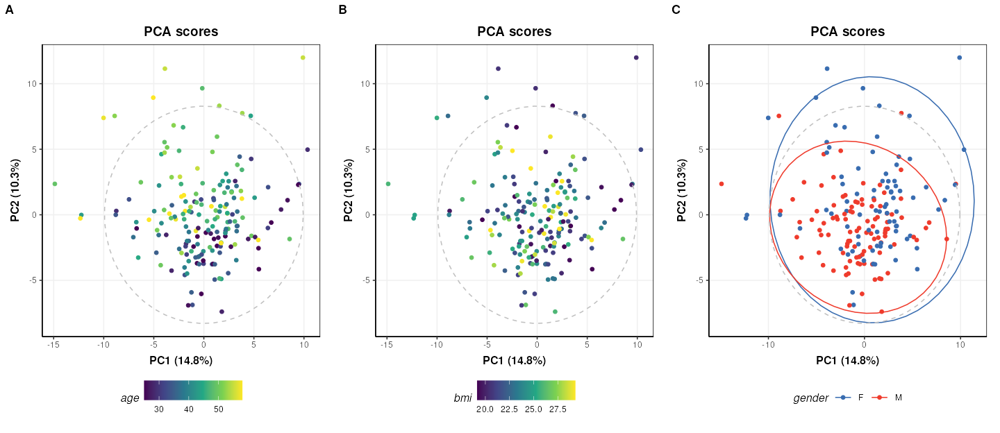
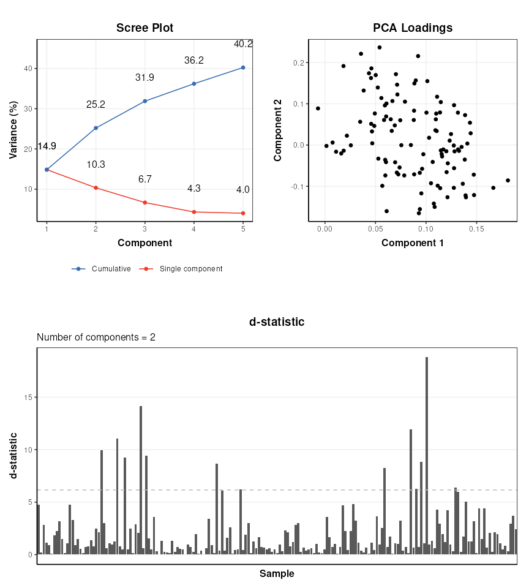
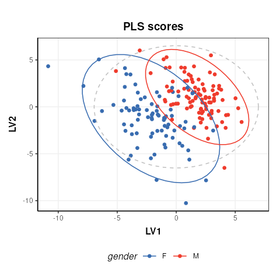
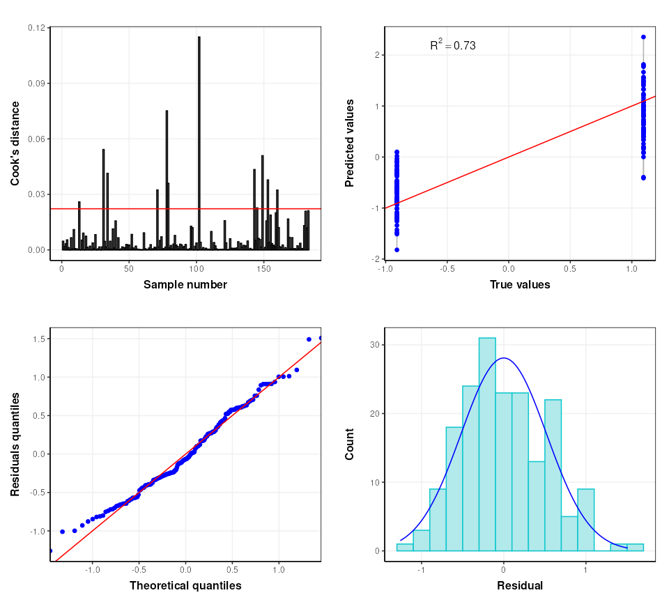
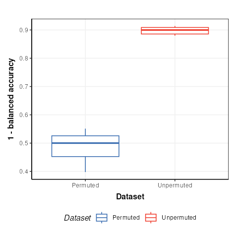

# Partial Least Squares (PLS) analysis of a untargeted LC-MS-based clinical metabolomics dataset.

## Introduction

The aim of this vignette is to demonstrate how to 1) apply and validate
Partial Least Squares (PLS) analysis using the structToolbox, 2)
reproduce statistical analysis in [Thevenot et
al. (2015)](https://pubs.acs.org/doi/10.1021/acs.jproteome.5b00354) and
3. compare different implementations of PLS.

## Dataset

The objective of the original study was to:

> …study the influence of age, body mass index (bmi), and gender on
> metabolite concentrations in urine, by analysing 183 samples from a
> cohort of adults with liquid chromatography coupled to high-resolution
> mass spectrometry.

[Thevenot et
al. (2015)](https://pubs.acs.org/doi/10.1021/acs.jproteome.5b00354)

The “Sacurine” dataset needs to be converted to a `DatasetExperiment`
object. The *[ropls](https://bioconductor.org/packages/3.23/ropls)*
package provides the data as a list containing a `dataMatrix`,
`sampleMetadata` and `variableMetadata`.

``` r

data('sacurine',package = 'ropls')
# the 'sacurine' list should now be available

# move the annotations to a new column and rename the features by index to avoid issues
# later when data.frames get transposed and names get checked/changed
sacurine$variableMetadata$annotation=rownames(sacurine$variableMetadata)
rownames(sacurine$variableMetadata)=1:nrow(sacurine$variableMetadata)
colnames(sacurine$dataMatrix)=1:ncol(sacurine$dataMatrix)

# create DatasetExperiment
DE = DatasetExperiment(data = data.frame(sacurine$dataMatrix),
                       sample_meta = sacurine$sampleMetadata,
                       variable_meta = sacurine$variableMetadata,
                       name = 'Sacurine data',
                       description = 'See ropls package documentation for details')

# print summary
DE
```

    ## A "DatasetExperiment" object
    ## ----------------------------
    ## name:          Sacurine data
    ## description:   See ropls package documentation for details
    ## data:          183 rows x 109 columns
    ## sample_meta:   183 rows x 3 columns
    ## variable_meta: 109 rows x 4 columns

## Data preprocessing

The Sacurine dataset used within this vignette has already been
pre-processed:

> After signal drift and batch effect correction of intensities, each
> urine profile was normalized to the osmolality of the sample. Finally,
> the data were log10 transformed.

## Exploratory data analysis

Since the data has already been processed the data can be visualised
using Principal Component Analysis (PCA) without further pre-processing.
The `ropls` package automatically applies unit variance scaling
(autoscaling) by default. The same approach is applied here.

``` r

# prepare model sequence
M = autoscale() + PCA(number_components = 5)
# apply model sequence to dataset
M = model_apply(M,DE)

# pca scores plots
g=list()
for (k in colnames(DE$sample_meta)) {
    C = pca_scores_plot(factor_name = k)
    g[[k]] = chart_plot(C,M[2])
}
# plot using cowplot
plot_grid(plotlist=g, nrow=1, align='vh', labels=c('A','B','C'))
```



The third plot coloured by gender (C) is identical to Figure 2 of the
*[ropls](https://bioconductor.org/packages/3.23/ropls)* package
vignette. The `structToolbox` package provides a range of PCA-related
diagnostic plots, including D-statistic, scree, and loadings plots.
These plots can be used to further explore the variance of the data.

``` r

C = pca_scree_plot()
g1 = chart_plot(C,M[2])

C = pca_loadings_plot()
g2 = chart_plot(C,M[2])

C = pca_dstat_plot(alpha=0.95)
g3 = chart_plot(C,M[2])

p1=plot_grid(plotlist = list(g1,g2),align='h',nrow=1,axis='b')
p2=plot_grid(plotlist = list(g3),nrow=1)
plot_grid(p1,p2,nrow=2)
```



## Partial Least Squares (PLS) analysis

The `ropls` package uses its own implementation of the (O)PLS
algorithms. `structToolbox` uses the `pls` package, so it is interesting
to compare the outputs from both approaches. For simplicity only the
scores plots are compared.

``` r

# prepare model sequence
M = autoscale() + PLSDA(factor_name='gender')
M = model_apply(M,DE)

C = pls_scores_plot(factor_name = 'gender')
chart_plot(C,M[2])
```



The plot is similar to fig.3 of the
*[ropls](https://bioconductor.org/packages/3.23/ropls)* vignette.
Differences are due to inverted LV axes, a common occurrence with the
NIPALS algorithm (used by both `structToolbox` and `ropls`) which
depends on how the algorithm is initialised.

To compare the R2 values for the model in structToolbox we have to use a
regression model, instead of a discriminant model. For this we convert
the gender factor to a numeric variable before applying the model.

``` r

# convert gender to numeric
DE$sample_meta$gender=as.numeric(DE$sample_meta$gender)

# models sequence
M = autoscale(mode='both') + PLSR(factor_name='gender',number_components=3)
M = model_apply(M,DE)

# some diagnostic charts
C = plsr_cook_dist()
g1 = chart_plot(C,M[2])

C = plsr_prediction_plot()
g2 = chart_plot(C,M[2])

C = plsr_qq_plot()
g3 = chart_plot(C,M[2])

C = plsr_residual_hist()
g4 = chart_plot(C,M[2])

plot_grid(plotlist = list(g1,g2,g3,g4), nrow=2,align='vh')
```



The `ropls` package automatically applies cross-validation to asses the
performance of the PLSDA model. In `structToolbox` this is applied
separately to give more control over the approach used if desired. The
default cross-validation used by the `ropls` package is 7-fold
cross-validation and we replicate that here.

``` r

# model sequence
M = kfold_xval(folds=7, factor_name='gender') * 
    (autoscale(mode='both') + PLSR(factor_name='gender'))
M = run(M,DE,r_squared())
```

Training set R2: 0.6975706 0.6798415 0.646671 0.6532914 0.7109769
0.670777 0.6935344

Test set Q2: 0.5460723

The validity of the model can further be assessed using permutation
testing. For this we will return to a discriminant model.

``` r

# reset gender to original factor
DE$sample_meta$gender=sacurine$sampleMetadata$gender
# model sequence
M = permutation_test(number_of_permutations = 10, factor_name='gender') *
    kfold_xval(folds=7,factor_name='gender') *
    (autoscale() + PLSDA(factor_name='gender',number_components = 3))
M = run(M,DE,balanced_accuracy())

C = permutation_test_plot(style='boxplot')
chart_plot(C,M)+ylab('1 - balanced accuracy')
```



The permuted models have a balanced accuracy of around 50%, which is to
be expected for a dataset with two groups. The unpermuted models have a
balanced accuracy of around 90% and is therefore much better than might
be expected to occur by chance.
