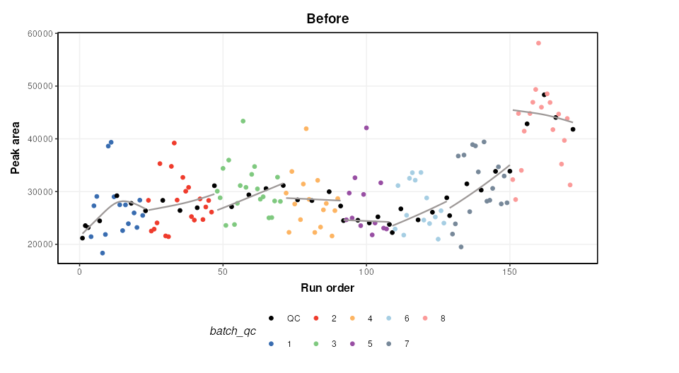
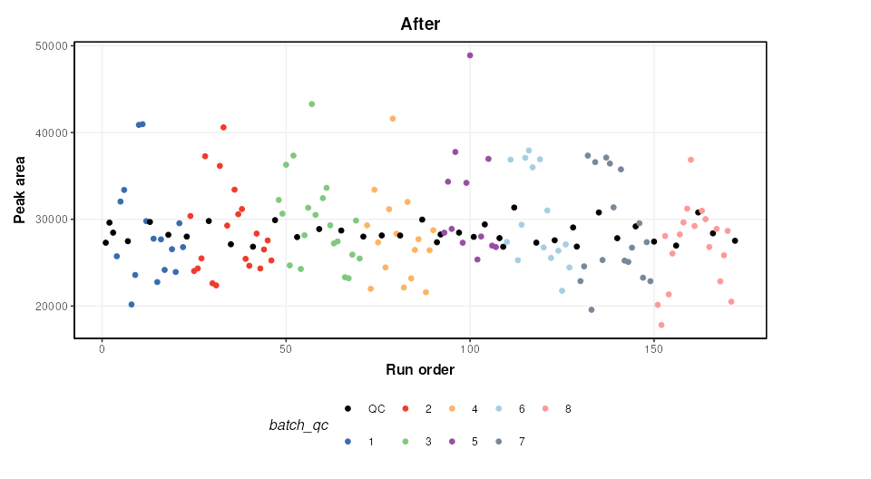
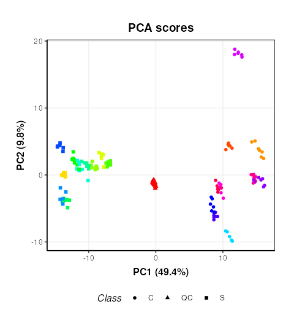
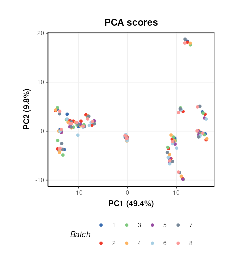

# A typical workflow for processing and analysing mass spectrometry-based metabolomics data

## Introduction

This vignette provides an overview of a `structToolbox` workflow
implemented to process (e.g. filter features, signal drift and batch
correction, normalise and missing value imputation) mass spectrometry
data. The workflow exists of methods that are part of the Peak Matrix
Processing (*[pmp](https://bioconductor.org/packages/3.23/pmp)*)
package, including a range of additional filters that are described in
Kirwan et al.,
[2013](https://link.springer.com/article/10.1007/s00216-013-6856-7),
[2014](https://doi.org/10.1038/sdata.2014.12).

Some packages are required for this vignette in addition
`structToolbox`:

## Dataset

For demonstration purposes we will process and analyse the MTBLS79
dataset (‘Dataset 7:SFPM’ Kirwan et al.,
[2014](https://doi.org/10.1038/sdata.2014.12). This dataset represents a
systematic evaluation of the reproducibility of a multi-batch
direct-infusion mass spectrometry (DIMS)-based metabolomics study of
cardiac tissue extracts. It comprises twenty biological samples (cow
vs. sheep) that were analysed repeatedly, in 8 batches across 7 days,
together with a concurrent set of quality control (QC) samples. Data are
presented from each step of the data processing workflow and are
available through MetaboLights
(<https://www.ebi.ac.uk/metabolights/MTBLS79>).

The `MTBLS79_DatasetExperiment` object included in the `structToolbox`
package is a processed version of the MTBLS79 dataset available in peak
matrix processing (*[pmp](https://bioconductor.org/packages/3.23/pmp)*)
package. This vignette describes step by step how the `structToolbox`
version was created from the `pmp` version (i.e. ‘Dataset 7:SFPM’ from
the Scientific Data publication -
<https://doi.org/10.1038/sdata.2014.12>).

The `SummarizedExperiment` object from the `pmp` package needs to be
converted to a `DatasetExperiment` object for use with `structToolbox`.

``` r

# the pmp SE object
SE = MTBLS79

# convert to DE
DE = as.DatasetExperiment(SE)
DE$name = 'MTBLS79'
DE$description = 'Converted from SE provided by the pmp package'

# add a column indicating the order the samples were measured in
DE$sample_meta$run_order = 1:nrow(DE)

# add a column indicating if the sample is biological or a QC
Type=as.character(DE$sample_meta$Class)
Type[Type != 'QC'] = 'Sample'
DE$sample_meta$Type = factor(Type)

# add a column for plotting batches
DE$sample_meta$batch_qc = DE$sample_meta$Batch
DE$sample_meta$batch_qc[DE$sample_meta$Type=='QC']='QC'

# convert to factors
DE$sample_meta$Batch = factor(DE$sample_meta$Batch)
DE$sample_meta$Type = factor(DE$sample_meta$Type)
DE$sample_meta$Class = factor(DE$sample_meta$Class)
DE$sample_meta$batch_qc = factor(DE$sample_meta$batch_qc)

# print summary
DE
```

    ## A "DatasetExperiment" object
    ## ----------------------------
    ## name:          MTBLS79
    ## description:   Converted from SE provided by the pmp package
    ## data:          172 rows x 2488 columns
    ## sample_meta:   172 rows x 7 columns
    ## variable_meta: 2488 rows x 0 columns

Full processing of the data set requires a number of steps. These will
be applied using a single `struct` model sequence (`model_seq`).

## Signal drift and batch correction

A batch correction algorithm is applied to reduce intra- and inter-
batch variations in the dataset. Quality Control-Robust Spline
Correction (QC-RSC) is provided in the `pmp` package, and it has been
wrapped into a `structToolbox` object called `sb_corr`.

``` r

M = # batch correction
    sb_corr(
      order_col='run_order',
      batch_col='Batch', 
      qc_col='Type', 
      qc_label='QC',
      spar_lim = c(0.6,0.8) 
    )

M = model_apply(M,DE)
```

The figure below shows a plot of a feature vs run order, before and
after the correction. The fitted spline for each batch is shown in grey.
It can be seen that the correction has removed instrument drift within
and between batches.

``` r

C = feature_profile(
      run_order='run_order',
      qc_label='QC',
      qc_column='Type',
      colour_by='batch_qc',
      feature_to_plot='200.03196',
      plot_sd=FALSE
  )

# plot and modify using ggplot2 
chart_plot(C,M,DE)+ylab('Peak area')+ggtitle('Before')
```



``` r

chart_plot(C,predicted(M))+ylab('Peak area')+ggtitle('After')
```



An additional step is added to the published workflow to remove any
feature not corrected by QCRCMS. This can occur if there are not enough
measured QC values within a batch. `QCRMS` in the `pmp` package
currently returns NA for all samples in the feature where this occurs.
Features where this occurs will be excluded.

``` r

M2 = filter_na_count(
      threshold=3,
      factor_name='Batch'
    )
M2 = model_apply(M2,predicted(M))

# calculate number of features removed
nc = ncol(DE) - ncol(predicted(M2))

cat(paste0('Number of features removed: ', nc))
```

    ## Number of features removed: 425

The output of this step is the output of
`MTBLS79_DatasetExperiment(filtered=FALSE)`.

## Feature filtering

In the journal article three spectral cleaning steps are applied. In the
first filter a Kruskal-Wallis test is used to identify features not
reliably detected in the QC samples (p \< 0.0001) of all batches. We
follow the same parameters as the original article and do not use
multiple test correction (`mtc = 'none'`).

``` r

M3 = kw_rank_sum(
      alpha=0.0001,
      mtc='none',
      factor_names='Batch',
      predicted='significant'
    ) +
    filter_by_name(
      mode='exclude',
      dimension = 'variable',
      seq_in = 'names', 
      names='seq_fcn', # this is a placeholder and will be replaced by seq_fcn
      seq_fcn=function(x){return(x[,1])}
    )
M3 = model_apply(M3, predicted(M2))

nc = ncol(predicted(M2)) - ncol(predicted(M3))
cat(paste0('Number of features removed: ', nc))
```

    ## Number of features removed: 262

To make use of univariate tests such as `kw_rank_sum` as a filter some
advanced features of `struct` are needed. Slots `predicted`, and
`seq_in` are used to ensure the correct output of the univariate test is
connected to the correct input of a feature filter using
`filter_by_name`. Another slot `seq_fcn` is used to extract the relevant
column of the `predicted` output so that it is compatible with the
`seq_in` input. A placeholder is used for the “names” parameter
(`names = 'place_holder'`) as this input will be replaced by the output
from `seq_fcn`.

The second filter is a Wilcoxon Signed-Rank test. It is used to identify
features that are not representative of the average of the biological
samples (p \< 1e-14). Again we make use of `seq_in` and `seq_fcn`.

``` r

M4 = wilcox_test(
      alpha=1e-14,
      factor_names='Type', 
      mtc='none', 
      predicted = 'significant'
    ) +
    filter_by_name(
      mode='exclude',
      dimension='variable',
      seq_in='names', 
      names='place_holder',
      seq_fcn=function(x){return(x$significant)}
    )
M4 = model_apply(M4, predicted(M3))

nc = ncol(predicted(M3)) - ncol(predicted(M4))
cat(paste0('Number of features removed: ', nc))
```

    ## Number of features removed: 169

Finally, an RSD filter is used to remove features with high analytical
variation (QC RSD \> 20 removed)

``` r

M5 = rsd_filter(
     rsd_threshold=20,
     factor_name='Type'
)
M5 = model_apply(M5,predicted(M4))

nc = ncol(predicted(M4)) - ncol(predicted(M5))
cat(paste0('Number of features removed: ', nc))
```

    ## Number of features removed: 53

The output of this filter is the output of
`MTBLS79_DatasetExperiment(filtered=TRUE)`.

## Normalisation, missing value imputation and scaling

We will apply a number of common pre-processing steps to the filtered
peak matrix that are identical to steps applied in are described in
Kirwan et
al. [2013](https://link.springer.com/article/10.1007/s00216-013-6856-7),
[2014](https://doi.org/10.1038/sdata.2014.12).

- Probabilistic Quotient Normalisation (PQN)
- k-nearest neighbours imputation (k = 5)
- Generalised log transform (glog)

These steps prepare the data for multivariate analysis by accounting for
sample concentration differences, imputing missing values and scaling
the data.

``` r

# peak matrix processing
M6 = pqn_norm(qc_label='QC',factor_name='Type') + 
     knn_impute(neighbours=5) +
     glog_transform(qc_label='QC',factor_name='Type')
M6 = model_apply(M6,predicted(M5))
```

## Exploratory Analysis

Principal Component Analysis (PCA) can be used to visualise
high-dimensional data. It is an unsupervised method that maximises
variance in a reduced number of latent variables, or principal
components.

``` r

# PCA
M7  = mean_centre() + PCA(number_components = 2)

# apply model sequence to data
M7 = model_apply(M7,predicted(M6))

# plot pca scores
C = pca_scores_plot(factor_name=c('Sample_Rep','Class'),ellipse='none')
chart_plot(C,M7[2]) + coord_fixed() +guides(colour=FALSE)
```

    ## Warning: The `<scale>` argument of `guides()` cannot be `FALSE`. Use "none" instead as
    ## of ggplot2 3.3.4.
    ## This warning is displayed once per session.
    ## Call `lifecycle::last_lifecycle_warnings()` to see where this warning was
    ## generated.



This plot is very similar to Figure 3b of the original publication
[link](https://www.nature.com/articles/sdata201412/figures/3). Sample
replicates are represented by colours and samples groups (C = cow and S
= Sheep) by different shapes.

Plotting the scores and colouring by Batch indicates that the
signal/batch correction was effective as all batches are overlapping.

``` r

# chart object
C = pca_scores_plot(factor_name=c('Batch'),ellipse='none')
# plot
chart_plot(C,M7[2]) + coord_fixed()
```


