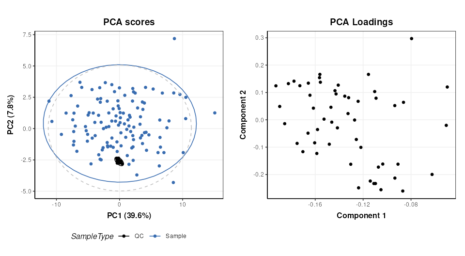
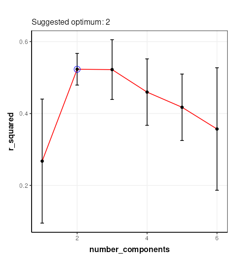
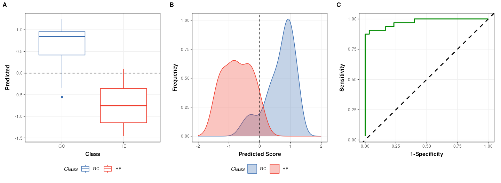
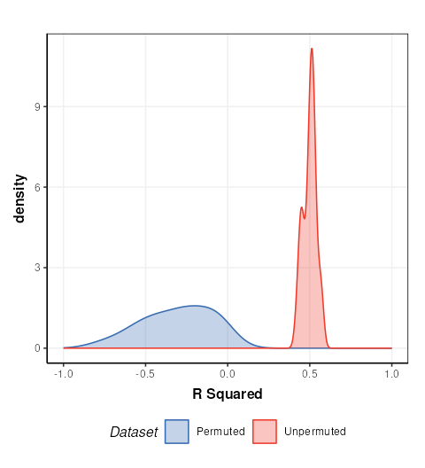
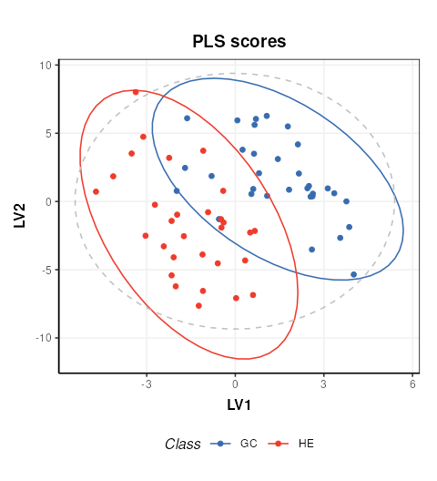
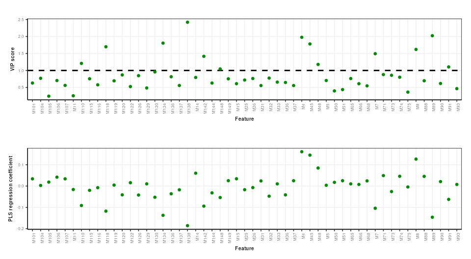

# Univariate and multivariate statistical analysis of a NMR-based clinical metabolomics dataset.

## Introduction

The purpose of this vignette is to demonstrate the different
functionalities and methods that are available as part of the
structToolbox and reproduce the data analysis reported in [Mendez et
al.,
(2020)](https://link.springer.com/article/10.1007/s11306-019-1588-0) and
[Chan et al., (2016)](https://www.nature.com/articles/bjc2015414).

## Dataset

The 1H-NMR dataset used and described in [Mendez et al.,
(2020)](https://link.springer.com/article/10.1007/s11306-019-1588-0) and
in this vignette contains processed spectra of urine samples obtained
from gastric cancer and healthy patients [Chan et al.,
(2016)](https://www.nature.com/articles/bjc2015414). The experimental
raw data is available through Metabolomics Workbench
([PR000699](http://dx.doi.org/10.21228/M8B10B)) and the processed
version is available from
[here](https://github.com/CIMCB/MetabWorkflowTutorial/raw/master/GastricCancer_NMR.xlsx)
as an Excel data file.

As a first step we need to reorganise and convert the Excel data file
into a DatasetExperiment object. Using the `openxlsx` package the file
can be read directly into an R `data.frame` and then manipulated as
required.

``` r

url = 'https://github.com/CIMCB/MetabWorkflowTutorial/raw/master/GastricCancer_NMR.xlsx'

# read in file directly from github...
# X=read.xlsx(url)

# ...or use BiocFileCache
path = bfcrpath(bfc,url)
X = read.xlsx(path)

# sample meta data
SM=X[,1:4]
rownames(SM)=SM$SampleID
# convert to factors
SM$SampleType=factor(SM$SampleType)
SM$Class=factor(SM$Class)
# keep a numeric version of class for regression
SM$Class_num = as.numeric(SM$Class)

## data matrix
# remove meta data
X[,1:4]=NULL
rownames(X)=SM$SampleID

# feature meta data
VM=data.frame(idx=1:ncol(X))
rownames(VM)=colnames(X)

# prepare DatasetExperiment
DE = DatasetExperiment(
    data=X,
    sample_meta=SM,
    variable_meta=VM,
    description='1H-NMR urinary metabolomic profiling for diagnosis of gastric cancer',
    name='Gastric cancer (NMR)')

DE
```

    ## A "DatasetExperiment" object
    ## ----------------------------
    ## name:          Gastric cancer (NMR)
    ## description:   1H-NMR urinary metabolomic profiling for diagnosis of gastric cancer
    ## data:          140 rows x 149 columns
    ## sample_meta:   140 rows x 5 columns
    ## variable_meta: 149 rows x 1 columns

## Data pre-processing and quality assessment

It is good practice to remove any features that may be of low quality,
and to assess the quality of the data in general. In the Tutorial
features with QC-RSD \> 20% and where more than 10% of the features are
missing are retained.

``` r

# prepare model sequence
M = rsd_filter(rsd_threshold=20,qc_label='QC',factor_name='Class') +
    mv_feature_filter(threshold = 10,method='across',factor_name='Class')

# apply model
M = model_apply(M,DE)

# get the model output
filtered = predicted(M)

# summary of filtered data
filtered
```

    ## A "DatasetExperiment" object
    ## ----------------------------
    ## name:          Gastric cancer (NMR)
    ## description:   1H-NMR urinary metabolomic profiling for diagnosis of gastric cancer
    ## data:          140 rows x 53 columns
    ## sample_meta:   140 rows x 5 columns
    ## variable_meta: 53 rows x 1 columns

Note there is an additional feature vs the the processing reported by
Mendez et. al. because the filters here use \>= or \<= instead of \> and
\<.

After suitable scaling and transformation PCA can be used to assess data
quality. It is expected that the biological variance (samples) will be
larger than the technical variance (QCs). In the workflow that we are
reproducing
([link](https://cimcb.github.io/MetabWorkflowTutorial/Tutorial1.html))
the following steps were applied:

- log10 transform
- autoscaling (scaled to unit variance)
- knn imputation (3 neighbours)

The transformed and scaled matrix in then used as input to PCA. Using
`struct` we can chain all of these steps into a single model sequence.

``` r

# prepare the model sequence
M = log_transform(base = 10) +
    autoscale() + 
    knn_impute(neighbours = 3) +
    PCA(number_components = 10)

# apply model sequence to data
M = model_apply(M,filtered)

# get the transformed, scaled and imputed matrix
TSI = predicted(M[3])

# scores plot
C = pca_scores_plot(factor_name = 'SampleType')
g1 = chart_plot(C,M[4])

# loadings plot
C = pca_loadings_plot()
g2 = chart_plot(C,M[4])

plot_grid(g1,g2,align='hv',nrow=1,axis='tblr')
```



## Univariate statistics

`structToolbox` provides a number of objects for ttest, counting numbers
of features etc. For brevity only the ttest is calculated for comparison
with the workflow we are following
([link](https://cimcb.github.io/MetabWorkflowTutorial/Tutorial1.html)).
The QC samples need to be excluded, and the data reduced to only the GC
and HE groups.

``` r

# prepare model
TT = filter_smeta(mode='include',factor_name='Class',levels=c('GC','HE')) +  
     ttest(alpha=0.05,mtc='fdr',factor_names='Class')

# apply model
TT = model_apply(TT,filtered)

# keep the data filtered by group for later
filtered = predicted(TT[1])

# convert to data frame
out=as_data_frame(TT[2])

# show first few features
head(out)
```

    ##     t_statistic   t_p_value t_significant estimate.mean.GC estimate.mean.HE
    ## M4    3.5392652 0.008421042          TRUE         51.73947         26.47778
    ## M5   -1.4296604 0.410396437         FALSE        169.91500        265.11860
    ## M7   -2.7456506 0.051494976         FALSE         53.98718        118.52558
    ## M8    2.1294198 0.178392032         FALSE         79.26750         54.39535
    ## M11  -0.5106536 0.776939682         FALSE        171.27949        201.34390
    ## M14   1.4786810 0.403091881         FALSE         83.90250         61.53171
    ##           lower     upper
    ## M4    10.961769  39.56162
    ## M5  -228.454679  38.04747
    ## M7  -111.468619 -17.60818
    ## M8     1.543611  48.20069
    ## M11 -147.434869  87.30604
    ## M14   -7.835950  52.57754

## Multivariate statistics and machine learning

### Training and Test sets

Splitting data into training and test sets is an important aspect of
machine learning. In `structToolbox` this is implemented using the
`split_data` object for random subsampling across the whole dataset, and
`stratified_split` for splitting based on group sizes, which is the
approach used by Mendez et al.

``` r

# prepare model
M = stratified_split(p_train=0.75,factor_name='Class')
# apply to filtered data
M = model_apply(M,filtered)
# get data from object
train = M$training
train
```

    ## A "DatasetExperiment" object
    ## ----------------------------
    ## name:          Gastric cancer (NMR)
    ##                (Training set)
    ## description:   • 1H-NMR urinary metabolomic profiling for diagnosis of gastric cancer
    ##                • A subset of the data has been selected as a training set
    ## data:          62 rows x 53 columns
    ## sample_meta:   62 rows x 5 columns
    ## variable_meta: 53 rows x 1 columns

``` r

cat('\n')
```

``` r

test = M$testing
test
```

    ## A "DatasetExperiment" object
    ## ----------------------------
    ## name:          Gastric cancer (NMR)
    ##                (Testing set)
    ## description:   • 1H-NMR urinary metabolomic profiling for diagnosis of gastric cancer
    ##                • A subset of the data has been selected as a test set
    ## data:          21 rows x 53 columns
    ## sample_meta:   21 rows x 5 columns
    ## variable_meta: 53 rows x 1 columns

### Optimal number of PLS components

In Mendez et al a k-fold cross-validation is used to determine the
optimal number of PLS components. 100 bootstrap iterations are used to
generate confidence intervals. In `strucToolbox` these are implemented
using “iterator” objects, that can be combined with model objects. R2 is
used as the metric for optimisation, so the `PLSR` model in
structToolbox will be used. For speed only 10 bootstrap iterations are
used here.

``` r

# scale/transform training data
M = log_transform(base = 10) +
    autoscale() + 
    knn_impute(neighbours = 3,by='samples')

# apply model
M = model_apply(M,train)

# get scaled/transformed training data
train_st = predicted(M)

# prepare model sequence
MS = grid_search_1d(
        param_to_optimise = 'number_components',
        search_values = as.numeric(c(1:6)),
        model_index = 2,
        factor_name = 'Class_num',
        max_min = 'max') *
     permute_sample_order(
        number_of_permutations = 10) *
     kfold_xval(
        folds = 5,
        factor_name = 'Class_num') * 
     (mean_centre(mode='sample_meta')+
      PLSR(factor_name='Class_num'))

# run the validation
MS = struct::run(MS,train_st,r_squared())

#
C = gs_line()
chart_plot(C,MS)
```



The chart plotted shows Q2, which is comparable with Figure 13 of
[Mendez et al](NA) . Two components were selected by Mendez et al, so we
will use that here.

### PLS model evalutation

To evaluate the model for discriminant analysis in structToolbox the
`PLSDA` model is appropriate.

``` r

# prepare the discriminant model
P = PLSDA(number_components = 2, factor_name='Class')

# apply the model
P = model_apply(P,train_st)

# charts
C = plsda_predicted_plot(factor_name='Class',style='boxplot')
g1 = chart_plot(C,P)

C = plsda_predicted_plot(factor_name='Class',style='density')
g2 = chart_plot(C,P)+xlim(c(-2,2))

C = plsda_roc_plot(factor_name='Class')
g3 = chart_plot(C,P)

plot_grid(g1,g2,g3,align='vh',axis='tblr',nrow=1, labels=c('A','B','C'))
```



``` r

# AUC for comparison with Mendez et al
MET = calculate(AUC(),P$y$Class,P$yhat[,1])
MET
```

    ## A "AUC" object
    ## --------------
    ## name:          Area under ROC curve
    ## description:   The area under the ROC curve of a classifier is estimated using the trapezoid method.
    ## value:         0.9739583

Note that the default cutoff in A and B of the figure above for the PLS
models in `structToolbox` is 0, because groups are encoded as +/-1. This
has no impact on the overall performance of the model.

### Permutation test

A permutation test can be used to assess how likely the observed result
is to have occurred by chance. In structToolbox `permutation_test` is an
iterator object that can be combined with other iterators and models.

``` r

# model sequence
MS = permutation_test(number_of_permutations = 20,factor_name = 'Class_num') * 
     kfold_xval(folds = 5,factor_name = 'Class_num') *
     (mean_centre(mode='sample_meta') + PLSR(factor_name='Class_num', number_components = 2))

# run iterator
MS = struct::run(MS,train_st,r_squared())

# chart
C = permutation_test_plot(style = 'density') 
chart_plot(C,MS) + xlim(c(-1,1)) + xlab('R Squared')
```



This plot is comparable to the bottom half of Figure 17 in [Mendez et.
al.](https://cimcb.github.io/MetabWorkflowTutorial/Tutorial1.html). The
unpermuted (true) Q2 values are consistently better than the permuted
(null) models. i.e. the model is reliable.

### PLS projection plots

PLS can also be used to visualise the model and interpret the latent
variables.

``` r

# prepare the discriminant model
P = PLSDA(number_components = 2, factor_name='Class')

# apply the model
P = model_apply(P,train_st)

C = pls_scores_plot(components=c(1,2),factor_name = 'Class')
chart_plot(C,P)
```



### PLS feature importance

Regression coefficients and VIP scores can be used to estimate the
importance of individual features to the PLS model. In Mendez et al
bootstrapping is used to estimate the confidence intervals, but for
brevity here we will skip this.

``` r

# prepare chart
C = pls_vip_plot(ycol = 'HE')
g1 = chart_plot(C,P)

C = pls_regcoeff_plot(ycol='HE')
g2 = chart_plot(C,P)

plot_grid(g1,g2,align='hv',axis='tblr',nrow=2)
```


