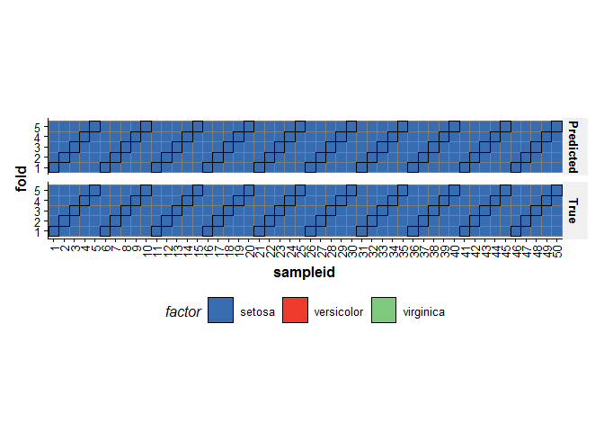
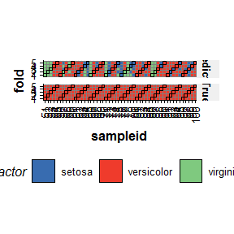
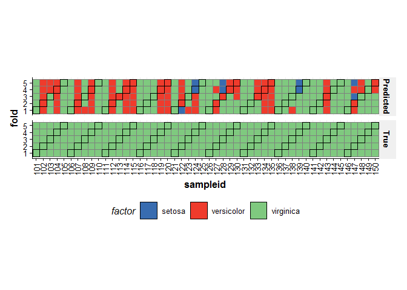

</br></br>

# Introduction
Validation is an important aspect of chemometric modelling. The `STRUCT` framework enables this kind of iterative model testing through `iterator` objects. In order to demonstrate this we will first load the iris data set, which as been pre-prepared as a dataset object as part of the `STRUCT` package.


```r
D = iris_dataset()
summary(D)
#> A dataset object from the struct package
#> 
#> Name: Iris
#> Description: Fisher's Iris data
#> 
#> Consists of 150 samples and 4 features.
#> 
#> There are 3 levels: setosa,versicolor,virginica in factor named "Species"
```

</br></br>

# Cross-validation
Cross validation is a common technique for assessing the performance of classification models. For this example we will use a PLSDA model. Data should be mean centred prior to PLS, so we will build a model sequence first.


```r
M = mean_centre() + PLSDA(number_components=2,factor_name='Species')
M
#> A model.seq object containing:
#> [1] Mean centre
#> [2] Partial least squares discriminant analysis
```

Iterators objects like the k-fold cross-validation object can be created just like any other struct object. Parameters can be set at creation =, and accessed/changed later using dollar notation.


```r
XCV = kfold_xval(folds=5,factor_name='Species')
# change the number of folds
XCV$folds=10
XCV$folds
#> [1] 10
```

The model to be cross-validated can be set/accessed used the `models` method.


```r
models(XCV)=M
models(XCV)
#> A model.seq object containing:
#> [1] Mean centre
#> [2] Partial least squares discriminant analysis
```

Alternatively,  iterators can be combined with models using the multiplication symbol:

```r
XCV = kfold_xval(folds=5,method='venetian',factor_name='Species') * 
      (mean_centre()+PLSDA(number_components = 2,factor_name='Species'))
```

The `run` method can be used with any iterator object. The iterator will then run the model sequence multiple times. In our case we will run cross-validation 5 times splitting the data into different training and test sets each time. The `run` method also needs a `metric` to be specified. This metric may be calculated once after all iterations, or after each iteration, depending on the iterator type (resampling, permutation etc). For cross-validation we will calculate balanced accuracy after all iterations.


```r
XCV = run(XCV,D,balanced_accuracy())
XCV$metric
```

<div data-pagedtable="false">
  <script data-pagedtable-source type="application/json">
{"columns":[{"label":["metric"],"name":[1],"type":["fctr"],"align":["left"]},{"label":["mean"],"name":[2],"type":["dbl"],"align":["right"]},{"label":["sd"],"name":[3],"type":["dbl"],"align":["right"]}],"data":[{"1":"balanced_accuracy","2":"0.23","3":"NA"}],"options":{"columns":{"min":{},"max":[10]},"rows":{"min":[10],"max":[10]},"pages":{}}}
  </script>
</div>

</br></br>

Like other `STRUCT` objects, iterators can have chart objects associated with them. The `chart.names` function will list them for an object.


```r
chart.names(XCV)
#> [1] "kfoldxcv_grid"   "kfoldxcv_metric"
```

Charts for iterator objects can be plotted in the same way as charts for any other object.


```r
C = kfoldxcv_grid()
chart.plot(C,XCV)
#> [[1]]
```



```
#> 
#> [[2]]
```



```
#> 
#> [[3]]
```



It is possible to combine multiple iterators by multiplying them together. This is equivalent to nesting one iterator inside the other. For example, we can repeat our cross-validation multiple times by permuting the sample order.


```r
P = permute_sample_order(number_of_permutations = 10) * 
    kfold_xval(folds=5,factor_name='Species')*
    (mean_centre() + PLSDA(factor_name='Species',number_components=2))
P = run(P,D,balanced_accuracy())
P$metric
```

<div data-pagedtable="false">
  <script data-pagedtable-source type="application/json">
{"columns":[{"label":[""],"name":["_rn_"],"type":[""],"align":["left"]},{"label":["metric"],"name":[1],"type":["fctr"],"align":["left"]},{"label":["mean"],"name":[2],"type":["dbl"],"align":["right"]},{"label":["sd"],"name":[3],"type":["dbl"],"align":["right"]}],"data":[{"1":"balanced_accuracy","2":"0.219","3":"0.02024846","_rn_":"1"}],"options":{"columns":{"min":{},"max":[10]},"rows":{"min":[10],"max":[10]},"pages":{}}}
  </script>
</div>


