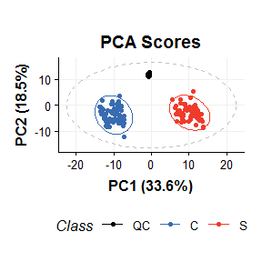
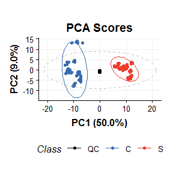
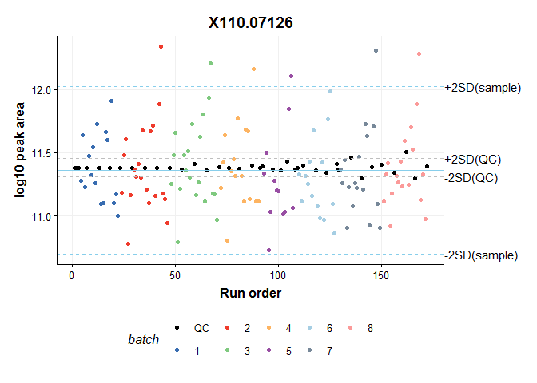
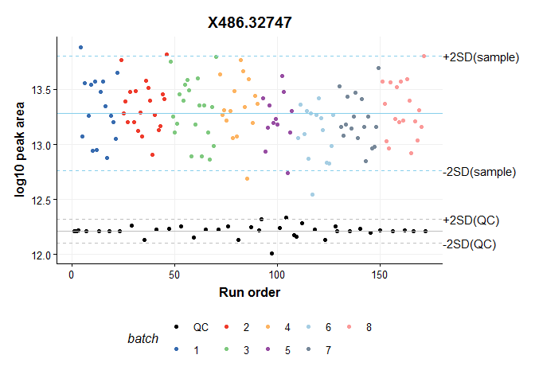
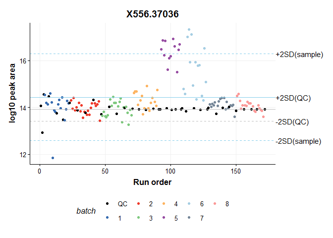
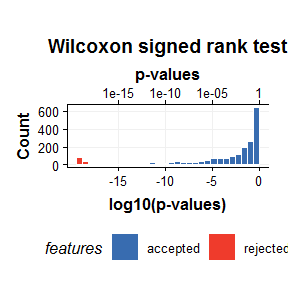
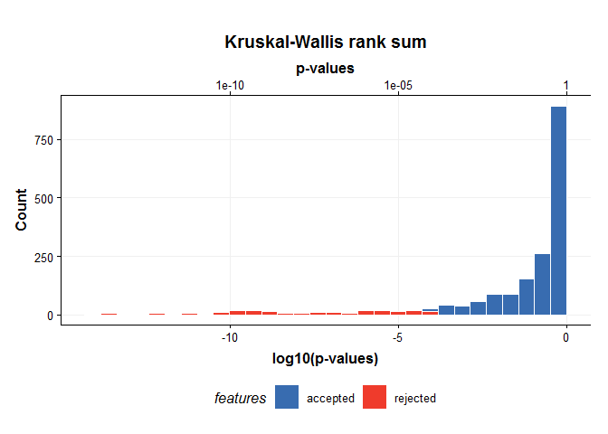

</br></br>

# Introduction
Method objects are similar to model objects in that they implement a method with the exception that they don't follow the same training/test approach as models; they are applied to the full dataset. Method objects can therefore also be used for approaches such as filtering, normalisation and scaling which (usually) get applied to the whole dataset rather than on a training/test basis. 

We will use the batch-corrected data available in the SBCMS package (https://www.github.com/computational-metabolomics/sbcms) as an example and use method objects available in `STRUCTToolbox` to reproduce the filtered data in the relevant publication (https://link.springer.com/article/10.1007%2Fs00216-013-6856-7).
</br></br>

## Loading the data
The batch-corrected data from the SBCMS package is included in `structToolbox`:


```r
D = sbcms_dataset()
summary(D)
#> A dataset object from the struct package
#> 
#> Name: SBCMS dataset
#> Description: SBCMS dataset after batch correction has been applied.
#> 
#> Consists of 172 samples and 2063 features.
#> 
#> There are 3 levels: C,QC,S in factor named "class"
```
</br></br>

Before we start detailing the use of method objects we will use a PCA model to verify that the batch-corrected data resembles Fig 4d from the article. The data needs to be normalised, imputed and scaled first, which are all methods in the toolbox. We will discuss their use in more detail in the following sections.


```r
# peak matrix processing
PMP = pqn_norm(qc_label = 'QC',factor_name='class') + 
      knn_impute(neighbours=5) + 
      glog_transform(qc_label='QC',factor_name='class')
PMP = method.apply(PMP,D)

# multivariate analysis
MVA = mean_centre() + PCA(number_components = 10)
MVA = model.train(MVA,predicted(PMP))
MVA = model.predict(MVA,predicted(PMP))

# charts
C = pca_scores_plot(factor_name = 'Class',groups=D$sample_meta$class)
chart.plot(C,MVA[2])
```



This should look very similar to Fig 4d in the paper, apart from possibly a change of sign on one or both of the components (this is due to ambiguity in PCA and is not a cause for concern), and slightly different % variance that arises due to differences in the batch correction processing of SBCMS. 

Now that we have verified our the data is at least similar to the published article we will discuss in more detail the use of method objects to apply additional filtering.

## Inputs/outputs
Method objects use the same system for getting/setting input parameters and outputs as other struct objects. They can be assigned when the object is created, and get/set later using $ notation. We will use the filter_na_count object to count the number of recorded measurments per feature.


```r
# initialise the method object
M = filter_na_count(factor_name='batch')

# apply the method
M = method.apply(M,D)

# get the counts
head(M$count)
#>    1  2  3  4  5  6  7  8 QC
#> 1 16 20 20 15 12 15  9  9 38
#> 2 16 20 20 16 12 15 14 16 38
#> 3 16 20 20 16 12 15 17 18 38
#> 4 15 19 18 15 12 15 15 16 38
#> 5 15 20 20 16 12 14 13 14 38
#> 6 15 20 20 16 12 15 16 17 38

# change the factor
M$factor_name='class'

# apply the method again
M = method.apply(M,D)

# get the counts
head(M$count)
#>    C QC  S
#> 1 63 38 53
#> 2 64 38 65
#> 3 66 38 68
#> 4 62 38 63
#> 5 65 38 59
#> 6 66 38 65
```

Note that method objects use `method.apply` instead of `model.train`/`model.predict` like model objects, and operate on the whole dataset.
</br></br>

## Method sequences
As shown in the introduction, we can chain together methods like we do for model objects using `+`. This creates a `method.seq` that can be executed using the `method.apply` command. As per the published article, the full sequence for this data is as follows:

1) Wilcoxon signed rank test to remove features where the QCs are 'significantly different' to the samples, with a p-value threshold of 1e-14 (determined empirically)
2) Krukal-Wallis rank sum test to remove features where there is a significant difference between batches (QCs excluded), with a p-value threshold of 1e-4 (detemined empirically)
3) Relative Standard Deviation (RSD) filter to remove features where the QC variance is less than 20x greater than the technical variance

Note that since these all operate on the features, we can apply them in any order.In our case it makes sense to apply rsd and wilcox which require the QC samples before removing them for the kruskal wallis test.


```r
# method sequence
     
MS = # rsd filter
     rsd_filter(rsd_threshold=20,qc_label='QC',factor_name='class') +
     # wilcox test
     wilcox_test(factor_names='sample_type',alpha = 1e-14, predicted='significant') + 
     filter_by_name(mode='exclude',dimension='variable',seq_in = 'names') +
     # remove QCs
     filter_smeta(mode='exclude',levels='QC',factor_name='class') +
     # kruskal wallis
     kw_rank_sum(alpha=1e-4,factor_names='batch',predicted = 'significant') +
     filter_by_name(mode='exclude',dimension='variable',seq_in = 'names')

# apply the sequence
MS = method.apply(MS,D)
```

This particular sequence makes use of the `predicted` and `seq_in` slots for method objects. The `predicted` slot indicates the name of the output that will be used as an input into the next object in the sequence. `seq_in` indicates the name of an input parameter that will be replaced by the output from the previous object. By default `seq_in = 'data'` but in this case we wanted the significant features from the Wilcoxon test (`predicted = 'significant'`) to be used to filter the data in the next step (`seq_opt = 'names'`). Likewise for the Kruskal-Wallis test.

The data presented in the published article includes the QC samples, so we need to filter the data including the QCs to contain the same features as our filtered data. We can extract the feature ids from the filtered dataset and use them to filter our dataset with QCs included. We can then normalise, impute and scale the data as per the published article.


```r
# get the feature ids to keep
to_filter = colnames(predicted(MS)$data)

# new method sequence
MS2 = # filter by id
     filter_by_name(mode='include',dimension='variable',names=to_filter) +
     # pqn normalised
     pqn_norm(qc_label = 'QC',factor_name='class') + 
     # impute missing values
     knn_impute(neighbours=5) + 
     # scale
     glog_transform(qc_label='QC',factor_name='class')

# apply the method sequence
MS2 = method.apply(MS2,D)
```

We are now ready to use this data with a PCA model. If done correctly the plot should be similar to Fig 4e in the published article (notwithstanding sign changes and small deviations in the % variance).


```r
# multivariate analysis
MVA2 = mean_centre() + PCA(number_components = 10)
MVA2 = model.train(MVA2,predicted(MS2))
MVA2 = model.predict(MVA2,predicted(MS2))

# charts
C = pca_scores_plot(factor_name = 'Class',groups=D$sample_meta$class)
chart.plot(C,MVA2[2])
```



We can further verify this by plotting the profile of a specific feature throughout the run, as per the Supplementary Information in the published article. A 'good' feature that survived all the filters:


```r
C=feature_profile(run_order='sample_order',
                  qc_label='QC',
                  qc_column='class',
                  colour_by='batch',
                  feature_to_plot='X110.07126')
chart.plot(C,predicted(MS2))
```



A 'bad' feature that did not survive filtering because the QCs are different to the samples (failed the Wilcoxon test):


```r
C=feature_profile(run_order='sample_order',
                  qc_label='QC',
                  qc_column='class',
                  colour_by='batch',
                  feature_to_plot='X486.32747')
chart.plot(C,predicted(PMP))
```



Another 'bad' feature that did not survive filtering because the samples in some batches are different to the others (failed the Kruskal-Wallis test):


```r
C=feature_profile(run_order='sample_order',
                  qc_label='QC',
                  qc_column='class',
                  colour_by='batch',
                  feature_to_plot='X556.37036')
chart.plot(C,predicted(PMP))
```



## method charts
Like other STRUCT objects method can be associated with chart objects. To see a list of charts associated with a particular method use the `chart.names` function. The charts can be plotted in the usual way using the `chart.plot` function. The outputs can be e.g. ggplot objects that you can add layers to aftwerwards if you want to. Note how we aaccess the Wilcoxon test object in our sequence using square brackets.


```r
# names of charts for wilcoxon method
chart.names(wilcox_test())
#> [1] "wilcox_p_hist"

# create object
C = wilcox_p_hist()

# plot
chart.plot(C,MS[2])
#> `stat_bin()` using `bins = 30`. Pick better value with `binwidth`.
#> `stat_bin()` using `bins = 30`. Pick better value with `binwidth`.
```



Theres one for the Kruskal wallis test too. Based on these plots you can see that the p-value thresholds in the published article were chosen to filter out small numbers of extreme outliers.


```r
# names of charts for wilcoxon method
chart.names(kw_rank_sum())
#> [1] "kw_p_hist"

# create object
C = kw_p_hist()

# plot
chart.plot(C,MS[5])
#> `stat_bin()` using `bins = 30`. Pick better value with `binwidth`.
#> `stat_bin()` using `bins = 30`. Pick better value with `binwidth`.
```



