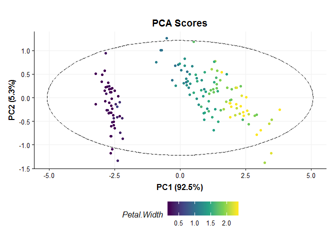
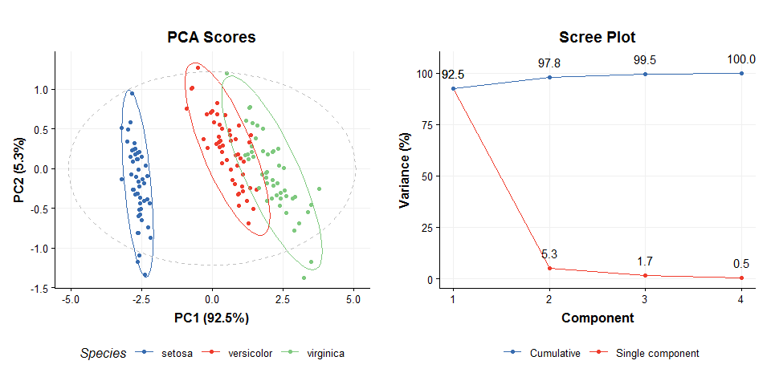

</br></br>

# Introduction
PCA (Principal Component Analysis) is a commonly applied method for exploring multivariate datasets. We will use the iris dataset as an example, which is included in the package and already prepared as a dataset object.


```r
D = iris_dataset()
D$data
```

<div data-pagedtable="false">
  <script data-pagedtable-source type="application/json">
{"columns":[{"label":["Sepal.Length"],"name":[1],"type":["dbl"],"align":["right"]},{"label":["Sepal.Width"],"name":[2],"type":["dbl"],"align":["right"]},{"label":["Petal.Length"],"name":[3],"type":["dbl"],"align":["right"]},{"label":["Petal.Width"],"name":[4],"type":["dbl"],"align":["right"]}],"data":[{"1":"5.1","2":"3.5","3":"1.4","4":"0.2"},{"1":"4.9","2":"3.0","3":"1.4","4":"0.2"},{"1":"4.7","2":"3.2","3":"1.3","4":"0.2"},{"1":"4.6","2":"3.1","3":"1.5","4":"0.2"},{"1":"5.0","2":"3.6","3":"1.4","4":"0.2"},{"1":"5.4","2":"3.9","3":"1.7","4":"0.4"},{"1":"4.6","2":"3.4","3":"1.4","4":"0.3"},{"1":"5.0","2":"3.4","3":"1.5","4":"0.2"},{"1":"4.4","2":"2.9","3":"1.4","4":"0.2"},{"1":"4.9","2":"3.1","3":"1.5","4":"0.1"},{"1":"5.4","2":"3.7","3":"1.5","4":"0.2"},{"1":"4.8","2":"3.4","3":"1.6","4":"0.2"},{"1":"4.8","2":"3.0","3":"1.4","4":"0.1"},{"1":"4.3","2":"3.0","3":"1.1","4":"0.1"},{"1":"5.8","2":"4.0","3":"1.2","4":"0.2"},{"1":"5.7","2":"4.4","3":"1.5","4":"0.4"},{"1":"5.4","2":"3.9","3":"1.3","4":"0.4"},{"1":"5.1","2":"3.5","3":"1.4","4":"0.3"},{"1":"5.7","2":"3.8","3":"1.7","4":"0.3"},{"1":"5.1","2":"3.8","3":"1.5","4":"0.3"},{"1":"5.4","2":"3.4","3":"1.7","4":"0.2"},{"1":"5.1","2":"3.7","3":"1.5","4":"0.4"},{"1":"4.6","2":"3.6","3":"1.0","4":"0.2"},{"1":"5.1","2":"3.3","3":"1.7","4":"0.5"},{"1":"4.8","2":"3.4","3":"1.9","4":"0.2"},{"1":"5.0","2":"3.0","3":"1.6","4":"0.2"},{"1":"5.0","2":"3.4","3":"1.6","4":"0.4"},{"1":"5.2","2":"3.5","3":"1.5","4":"0.2"},{"1":"5.2","2":"3.4","3":"1.4","4":"0.2"},{"1":"4.7","2":"3.2","3":"1.6","4":"0.2"},{"1":"4.8","2":"3.1","3":"1.6","4":"0.2"},{"1":"5.4","2":"3.4","3":"1.5","4":"0.4"},{"1":"5.2","2":"4.1","3":"1.5","4":"0.1"},{"1":"5.5","2":"4.2","3":"1.4","4":"0.2"},{"1":"4.9","2":"3.1","3":"1.5","4":"0.2"},{"1":"5.0","2":"3.2","3":"1.2","4":"0.2"},{"1":"5.5","2":"3.5","3":"1.3","4":"0.2"},{"1":"4.9","2":"3.6","3":"1.4","4":"0.1"},{"1":"4.4","2":"3.0","3":"1.3","4":"0.2"},{"1":"5.1","2":"3.4","3":"1.5","4":"0.2"},{"1":"5.0","2":"3.5","3":"1.3","4":"0.3"},{"1":"4.5","2":"2.3","3":"1.3","4":"0.3"},{"1":"4.4","2":"3.2","3":"1.3","4":"0.2"},{"1":"5.0","2":"3.5","3":"1.6","4":"0.6"},{"1":"5.1","2":"3.8","3":"1.9","4":"0.4"},{"1":"4.8","2":"3.0","3":"1.4","4":"0.3"},{"1":"5.1","2":"3.8","3":"1.6","4":"0.2"},{"1":"4.6","2":"3.2","3":"1.4","4":"0.2"},{"1":"5.3","2":"3.7","3":"1.5","4":"0.2"},{"1":"5.0","2":"3.3","3":"1.4","4":"0.2"},{"1":"7.0","2":"3.2","3":"4.7","4":"1.4"},{"1":"6.4","2":"3.2","3":"4.5","4":"1.5"},{"1":"6.9","2":"3.1","3":"4.9","4":"1.5"},{"1":"5.5","2":"2.3","3":"4.0","4":"1.3"},{"1":"6.5","2":"2.8","3":"4.6","4":"1.5"},{"1":"5.7","2":"2.8","3":"4.5","4":"1.3"},{"1":"6.3","2":"3.3","3":"4.7","4":"1.6"},{"1":"4.9","2":"2.4","3":"3.3","4":"1.0"},{"1":"6.6","2":"2.9","3":"4.6","4":"1.3"},{"1":"5.2","2":"2.7","3":"3.9","4":"1.4"},{"1":"5.0","2":"2.0","3":"3.5","4":"1.0"},{"1":"5.9","2":"3.0","3":"4.2","4":"1.5"},{"1":"6.0","2":"2.2","3":"4.0","4":"1.0"},{"1":"6.1","2":"2.9","3":"4.7","4":"1.4"},{"1":"5.6","2":"2.9","3":"3.6","4":"1.3"},{"1":"6.7","2":"3.1","3":"4.4","4":"1.4"},{"1":"5.6","2":"3.0","3":"4.5","4":"1.5"},{"1":"5.8","2":"2.7","3":"4.1","4":"1.0"},{"1":"6.2","2":"2.2","3":"4.5","4":"1.5"},{"1":"5.6","2":"2.5","3":"3.9","4":"1.1"},{"1":"5.9","2":"3.2","3":"4.8","4":"1.8"},{"1":"6.1","2":"2.8","3":"4.0","4":"1.3"},{"1":"6.3","2":"2.5","3":"4.9","4":"1.5"},{"1":"6.1","2":"2.8","3":"4.7","4":"1.2"},{"1":"6.4","2":"2.9","3":"4.3","4":"1.3"},{"1":"6.6","2":"3.0","3":"4.4","4":"1.4"},{"1":"6.8","2":"2.8","3":"4.8","4":"1.4"},{"1":"6.7","2":"3.0","3":"5.0","4":"1.7"},{"1":"6.0","2":"2.9","3":"4.5","4":"1.5"},{"1":"5.7","2":"2.6","3":"3.5","4":"1.0"},{"1":"5.5","2":"2.4","3":"3.8","4":"1.1"},{"1":"5.5","2":"2.4","3":"3.7","4":"1.0"},{"1":"5.8","2":"2.7","3":"3.9","4":"1.2"},{"1":"6.0","2":"2.7","3":"5.1","4":"1.6"},{"1":"5.4","2":"3.0","3":"4.5","4":"1.5"},{"1":"6.0","2":"3.4","3":"4.5","4":"1.6"},{"1":"6.7","2":"3.1","3":"4.7","4":"1.5"},{"1":"6.3","2":"2.3","3":"4.4","4":"1.3"},{"1":"5.6","2":"3.0","3":"4.1","4":"1.3"},{"1":"5.5","2":"2.5","3":"4.0","4":"1.3"},{"1":"5.5","2":"2.6","3":"4.4","4":"1.2"},{"1":"6.1","2":"3.0","3":"4.6","4":"1.4"},{"1":"5.8","2":"2.6","3":"4.0","4":"1.2"},{"1":"5.0","2":"2.3","3":"3.3","4":"1.0"},{"1":"5.6","2":"2.7","3":"4.2","4":"1.3"},{"1":"5.7","2":"3.0","3":"4.2","4":"1.2"},{"1":"5.7","2":"2.9","3":"4.2","4":"1.3"},{"1":"6.2","2":"2.9","3":"4.3","4":"1.3"},{"1":"5.1","2":"2.5","3":"3.0","4":"1.1"},{"1":"5.7","2":"2.8","3":"4.1","4":"1.3"},{"1":"6.3","2":"3.3","3":"6.0","4":"2.5"},{"1":"5.8","2":"2.7","3":"5.1","4":"1.9"},{"1":"7.1","2":"3.0","3":"5.9","4":"2.1"},{"1":"6.3","2":"2.9","3":"5.6","4":"1.8"},{"1":"6.5","2":"3.0","3":"5.8","4":"2.2"},{"1":"7.6","2":"3.0","3":"6.6","4":"2.1"},{"1":"4.9","2":"2.5","3":"4.5","4":"1.7"},{"1":"7.3","2":"2.9","3":"6.3","4":"1.8"},{"1":"6.7","2":"2.5","3":"5.8","4":"1.8"},{"1":"7.2","2":"3.6","3":"6.1","4":"2.5"},{"1":"6.5","2":"3.2","3":"5.1","4":"2.0"},{"1":"6.4","2":"2.7","3":"5.3","4":"1.9"},{"1":"6.8","2":"3.0","3":"5.5","4":"2.1"},{"1":"5.7","2":"2.5","3":"5.0","4":"2.0"},{"1":"5.8","2":"2.8","3":"5.1","4":"2.4"},{"1":"6.4","2":"3.2","3":"5.3","4":"2.3"},{"1":"6.5","2":"3.0","3":"5.5","4":"1.8"},{"1":"7.7","2":"3.8","3":"6.7","4":"2.2"},{"1":"7.7","2":"2.6","3":"6.9","4":"2.3"},{"1":"6.0","2":"2.2","3":"5.0","4":"1.5"},{"1":"6.9","2":"3.2","3":"5.7","4":"2.3"},{"1":"5.6","2":"2.8","3":"4.9","4":"2.0"},{"1":"7.7","2":"2.8","3":"6.7","4":"2.0"},{"1":"6.3","2":"2.7","3":"4.9","4":"1.8"},{"1":"6.7","2":"3.3","3":"5.7","4":"2.1"},{"1":"7.2","2":"3.2","3":"6.0","4":"1.8"},{"1":"6.2","2":"2.8","3":"4.8","4":"1.8"},{"1":"6.1","2":"3.0","3":"4.9","4":"1.8"},{"1":"6.4","2":"2.8","3":"5.6","4":"2.1"},{"1":"7.2","2":"3.0","3":"5.8","4":"1.6"},{"1":"7.4","2":"2.8","3":"6.1","4":"1.9"},{"1":"7.9","2":"3.8","3":"6.4","4":"2.0"},{"1":"6.4","2":"2.8","3":"5.6","4":"2.2"},{"1":"6.3","2":"2.8","3":"5.1","4":"1.5"},{"1":"6.1","2":"2.6","3":"5.6","4":"1.4"},{"1":"7.7","2":"3.0","3":"6.1","4":"2.3"},{"1":"6.3","2":"3.4","3":"5.6","4":"2.4"},{"1":"6.4","2":"3.1","3":"5.5","4":"1.8"},{"1":"6.0","2":"3.0","3":"4.8","4":"1.8"},{"1":"6.9","2":"3.1","3":"5.4","4":"2.1"},{"1":"6.7","2":"3.1","3":"5.6","4":"2.4"},{"1":"6.9","2":"3.1","3":"5.1","4":"2.3"},{"1":"5.8","2":"2.7","3":"5.1","4":"1.9"},{"1":"6.8","2":"3.2","3":"5.9","4":"2.3"},{"1":"6.7","2":"3.3","3":"5.7","4":"2.5"},{"1":"6.7","2":"3.0","3":"5.2","4":"2.3"},{"1":"6.3","2":"2.5","3":"5.0","4":"1.9"},{"1":"6.5","2":"3.0","3":"5.2","4":"2.0"},{"1":"6.2","2":"3.4","3":"5.4","4":"2.3"},{"1":"5.9","2":"3.0","3":"5.1","4":"1.8"}],"options":{"columns":{"min":{},"max":[10]},"rows":{"min":[10],"max":[10]},"pages":{}}}
  </script>
</div>
 
</br></br>

# PCA model
Before we apply PCA we first need to create a PCA object. This object contains all the inputs, outputs and methods needed to apply PCA. We can set parameters such as the number of components when the PCA model is created, but we can also use dollar notation to change/view it later. 


```r
P = PCA(number_components=15)
P$number_components=5
P$number_components
#> [1] 5
```
  
The inputs for a model can be listed using `param.ids(object)`:


```r
param.ids(P)
#> [1] "number_components"
```
</br></br>

# Model sequences
Unless you have very good reason not to, it is usally sensible to mean centre the columns of the data before PCA. Using the `STRUCT` framework we can create a model sequence that will mean centre and then apply PCA to the mean centred data.


```r
M = mean_centre() + PCA(number_components = 4)
```
  
In `STRUCT` mean centring and PCA are both model objects, and therefore joining them creates a model.sequence object. The objects in the sequence can be accessed by indexing, and we can combine this with dollar notation. For example, the PCA object is the second object in our sequence and we can access the number of components like this:


```r
M[2]$number_components
#> [1] 4
```
</br></br>

# Training/testing models
Model and model.sequence objects need to be trained using a training dataset.


```r
M = model.train(M,D)
```
  
Model objects can be used to generate predictions for test datasets. For this example we will just use the training data (sometimes called autoprediction).


```r
M = model.predict(M,D)
```

The available outputs for an object can be listed and accessed using dollar notation:
  

```r
output.ids(M[2])
#> [1] "scores"      "loadings"    "eigenvalues" "ssx"         "correlation"
#> [6] "that"
M[2]$scores
```

<div data-pagedtable="false">
  <script data-pagedtable-source type="application/json">
{"columns":[{"label":["PC1"],"name":[1],"type":["dbl"],"align":["right"]},{"label":["PC2"],"name":[2],"type":["dbl"],"align":["right"]},{"label":["PC3"],"name":[3],"type":["dbl"],"align":["right"]},{"label":["PC4"],"name":[4],"type":["dbl"],"align":["right"]}],"data":[{"1":"-2.684125626","2":"-0.319397247","3":"0.027914828","4":"0.0022624371"},{"1":"-2.714141687","2":"0.177001225","3":"0.210464272","4":"0.0990265503"},{"1":"-2.888990569","2":"0.144949426","3":"-0.017900256","4":"0.0199683897"},{"1":"-2.745342856","2":"0.318298979","3":"-0.031559374","4":"-0.0755758166"},{"1":"-2.728716537","2":"-0.326754513","3":"-0.090079241","4":"-0.0612585926"},{"1":"-2.280859633","2":"-0.741330449","3":"-0.168677658","4":"-0.0242008576"},{"1":"-2.820537751","2":"0.089461385","3":"-0.257892158","4":"-0.0481431065"},{"1":"-2.626144973","2":"-0.163384960","3":"0.021879318","4":"-0.0452978706"},{"1":"-2.886382732","2":"0.578311754","3":"-0.020759570","4":"-0.0267447358"},{"1":"-2.672755798","2":"0.113774246","3":"0.197632725","4":"-0.0562954013"},{"1":"-2.506947091","2":"-0.645068899","3":"0.075318009","4":"-0.0150199245"},{"1":"-2.612755231","2":"-0.014729939","3":"-0.102150260","4":"-0.1563792078"},{"1":"-2.786109266","2":"0.235112000","3":"0.206844430","4":"-0.0078879115"},{"1":"-3.223803744","2":"0.511394587","3":"-0.061299672","4":"-0.0216798118"},{"1":"-2.644750390","2":"-1.178764636","3":"0.151627524","4":"0.1592097177"},{"1":"-2.386039034","2":"-1.338062330","3":"-0.277776903","4":"0.0065515459"},{"1":"-2.623527875","2":"-0.810679514","3":"-0.138183228","4":"0.1677347372"},{"1":"-2.648296706","2":"-0.311849145","3":"-0.026668316","4":"0.0776281796"},{"1":"-2.199820324","2":"-0.872839039","3":"0.120305523","4":"0.0270518681"},{"1":"-2.587986400","2":"-0.513560309","3":"-0.213665172","4":"-0.0662726502"},{"1":"-2.310256215","2":"-0.391345936","3":"0.239444043","4":"-0.0150707908"},{"1":"-2.543705229","2":"-0.432996063","3":"-0.208457232","4":"0.0410654027"},{"1":"-3.215939416","2":"-0.133468070","3":"-0.292396751","4":"0.0044821251"},{"1":"-2.302733182","2":"-0.098708855","3":"-0.039123259","4":"0.1483525893"},{"1":"-2.355754049","2":"0.037281860","3":"-0.125021083","4":"-0.3003309039"},{"1":"-2.506668907","2":"0.146016880","3":"0.253420042","4":"0.0346074722"},{"1":"-2.468820073","2":"-0.130951489","3":"-0.094910576","4":"0.0574497158"},{"1":"-2.562319906","2":"-0.367718857","3":"0.078494205","4":"-0.0141727423"},{"1":"-2.639534715","2":"-0.312039980","3":"0.145908896","4":"0.0657834667"},{"1":"-2.631989387","2":"0.196961225","3":"-0.040771079","4":"-0.1239833064"},{"1":"-2.587398477","2":"0.204318491","3":"0.077222989","4":"-0.0604622767"},{"1":"-2.409932497","2":"-0.410924264","3":"0.145524972","4":"0.2316284917"},{"1":"-2.648862334","2":"-0.813363820","3":"-0.225669150","4":"-0.2813723471"},{"1":"-2.598736749","2":"-1.093145759","3":"-0.157810813","4":"-0.0953488583"},{"1":"-2.636926878","2":"0.121322348","3":"0.143049582","4":"0.0190703413"},{"1":"-2.866241652","2":"-0.069364472","3":"0.164332307","4":"0.1625984463"},{"1":"-2.625238050","2":"-0.599370021","3":"0.268350376","4":"0.1764412129"},{"1":"-2.800684115","2":"-0.268643738","3":"-0.093699082","4":"-0.1681730544"},{"1":"-2.980502044","2":"0.487958344","3":"-0.072927046","4":"-0.0107331474"},{"1":"-2.590006314","2":"-0.229043837","3":"0.080082303","4":"-0.0137491513"},{"1":"-2.770102426","2":"-0.263527534","3":"-0.077247693","4":"0.0940633590"},{"1":"-2.849368705","2":"0.940960574","3":"0.349230377","4":"0.3199874870"},{"1":"-2.997406547","2":"0.341926057","3":"-0.192509212","4":"-0.0746777682"},{"1":"-2.405614485","2":"-0.188871429","3":"-0.263867946","4":"0.1762088905"},{"1":"-2.209489238","2":"-0.436663142","3":"-0.298742746","4":"-0.1828425025"},{"1":"-2.714451427","2":"0.250208204","3":"0.097678144","4":"0.1428435736"},{"1":"-2.538148259","2":"-0.503771144","3":"-0.166705637","4":"-0.1896222914"},{"1":"-2.839462168","2":"0.227945569","3":"-0.083726849","4":"-0.0595642283"},{"1":"-2.543085750","2":"-0.579410022","3":"0.017115024","4":"-0.0465686438"},{"1":"-2.703359782","2":"-0.107706082","3":"0.089294008","4":"0.0346583385"},{"1":"1.284825689","2":"-0.685160470","3":"0.406568025","4":"0.0185252879"},{"1":"0.932488532","2":"-0.318333638","3":"0.018014187","4":"0.0005665121"},{"1":"1.464302322","2":"-0.504262815","3":"0.338325765","4":"-0.0016531759"},{"1":"0.183317720","2":"0.827959012","3":"0.179591392","4":"0.0935668402"},{"1":"1.088103258","2":"-0.074590675","3":"0.307757896","4":"0.1120205742"},{"1":"0.641669084","2":"0.418246872","3":"-0.041076091","4":"-0.2431167665"},{"1":"1.095060663","2":"-0.283468270","3":"-0.169810240","4":"-0.0835565724"},{"1":"-0.749122670","2":"1.004890961","3":"-0.012302919","4":"-0.0179077226"},{"1":"1.044131826","2":"-0.228361900","3":"0.415336085","4":"-0.0391345020"},{"1":"-0.008745404","2":"0.723081905","3":"-0.281141431","4":"-0.0056189179"},{"1":"-0.507840884","2":"1.265971191","3":"0.269817183","4":"0.0455624408"},{"1":"0.511698557","2":"0.103981235","3":"-0.130547750","4":"0.0507192325"},{"1":"0.264976508","2":"0.550036464","3":"0.694146830","4":"0.0571855195"},{"1":"0.984934510","2":"0.124817854","3":"0.062114408","4":"-0.1694962546"},{"1":"-0.173925372","2":"0.254854209","3":"-0.090457691","4":"0.1252172921"},{"1":"0.927860781","2":"-0.467179494","3":"0.314620976","4":"0.0998031365"},{"1":"0.660283762","2":"0.352969666","3":"-0.328027528","4":"-0.1878786215"},{"1":"0.236104993","2":"0.333610767","3":"0.271161837","4":"-0.2137573696"},{"1":"0.944733728","2":"0.543145551","3":"0.499519046","4":"0.2571921772"},{"1":"0.045226976","2":"0.583834377","3":"0.235002105","4":"-0.0415766476"},{"1":"1.116283177","2":"0.084616852","3":"-0.459620991","4":"-0.0750315529"},{"1":"0.357888418","2":"0.068925032","3":"0.229853888","4":"0.1229976041"},{"1":"1.298183875","2":"0.327787308","3":"0.347854352","4":"0.0008883706"},{"1":"0.921728922","2":"0.182737794","3":"0.231071778","4":"-0.2882554293"},{"1":"0.714853326","2":"-0.149055944","3":"0.321800937","4":"0.0417197556"},{"1":"0.900174373","2":"-0.328504474","3":"0.316209074","4":"0.1002267276"},{"1":"1.332024437","2":"-0.244440876","3":"0.521702780","4":"0.0353331921"},{"1":"1.557802155","2":"-0.267495447","3":"0.164920984","4":"0.0699692823"},{"1":"0.813290650","2":"0.163350301","3":"-0.035424505","4":"-0.0297114340"},{"1":"-0.305583778","2":"0.368262190","3":"0.318491581","4":"0.0745696136"},{"1":"-0.068126492","2":"0.705172132","3":"0.244213810","4":"0.0068308422"},{"1":"-0.189622472","2":"0.680286764","3":"0.306420561","4":"-0.0205510016"},{"1":"0.136428712","2":"0.314032438","3":"0.177242766","4":"0.0329419128"},{"1":"1.380026436","2":"0.420954287","3":"-0.016167128","4":"-0.1783044629"},{"1":"0.588006443","2":"0.484287420","3":"-0.444433499","4":"-0.2509760601"},{"1":"0.806858313","2":"-0.194182315","3":"-0.388963063","4":"-0.1142072433"},{"1":"1.220690882","2":"-0.407619594","3":"0.237167010","4":"0.0312171829"},{"1":"0.815095236","2":"0.372037060","3":"0.614720843","4":"0.1540209998"},{"1":"0.245957680","2":"0.268524397","3":"-0.188366812","4":"-0.1466745117"},{"1":"0.166413217","2":"0.681926725","3":"0.060009226","4":"0.0296222195"},{"1":"0.464800288","2":"0.670711545","3":"0.024306856","4":"-0.2696514282"},{"1":"0.890815198","2":"0.034464444","3":"0.009946933","4":"-0.1534846663"},{"1":"0.230548024","2":"0.404385848","3":"0.229410241","4":"0.0169303245"},{"1":"-0.704531759","2":"1.012248228","3":"0.105691149","4":"0.0456133071"},{"1":"0.356981495","2":"0.504910093","3":"-0.016617170","4":"-0.0987414793"},{"1":"0.331934480","2":"0.212654684","3":"-0.083204291","4":"-0.2384754337"},{"1":"0.376215651","2":"0.293218929","3":"-0.077996351","4":"-0.1311373808"},{"1":"0.642576008","2":"-0.017738190","3":"0.205394967","4":"-0.0213776830"},{"1":"-0.906469865","2":"0.756093367","3":"0.012599648","4":"0.2325348443"},{"1":"0.299000842","2":"0.348897806","3":"-0.010581660","4":"-0.0511811717"},{"1":"2.531192728","2":"0.009849109","3":"-0.760165427","4":"-0.0290555728"},{"1":"1.415235877","2":"0.574916348","3":"-0.296322527","4":"-0.0153046739"},{"1":"2.616676016","2":"-0.343903151","3":"0.110787883","4":"0.0657720412"},{"1":"1.971531053","2":"0.179727904","3":"-0.108424662","4":"-0.2367909342"},{"1":"2.350005920","2":"0.040260947","3":"-0.285389563","4":"-0.0001706333"},{"1":"3.397038736","2":"-0.550836673","3":"0.348437556","4":"-0.1123716532"},{"1":"0.521232244","2":"1.192758727","3":"-0.545659296","4":"-0.0981266196"},{"1":"2.932587069","2":"-0.355500003","3":"0.420239936","4":"-0.2571910322"},{"1":"2.321228817","2":"0.243831502","3":"0.348304395","4":"-0.0786746130"},{"1":"2.916750967","2":"-0.782791949","3":"-0.423335418","4":"0.1109820710"},{"1":"1.661774154","2":"-0.242228408","3":"-0.242440190","4":"0.1210405518"},{"1":"1.803401953","2":"0.215637617","3":"0.037648168","4":"0.0780198444"},{"1":"2.165591796","2":"-0.216275585","3":"-0.033326642","4":"0.1630614782"},{"1":"1.346163579","2":"0.776818347","3":"-0.281902882","4":"0.1404408688"},{"1":"1.585928224","2":"0.539640714","3":"-0.629029326","4":"0.3295517284"},{"1":"1.904456375","2":"-0.119250692","3":"-0.479639820","4":"0.2196212627"},{"1":"1.949689059","2":"-0.041943260","3":"-0.044186168","4":"-0.1576819073"},{"1":"3.487055364","2":"-1.175739330","3":"-0.133894874","4":"-0.3092195730"},{"1":"3.795645422","2":"-0.257322973","3":"0.513767764","4":"0.0538460965"},{"1":"1.300791713","2":"0.761149636","3":"0.344995038","4":"-0.0458247549"},{"1":"2.427817913","2":"-0.378196013","3":"-0.219119324","4":"0.1854292644"},{"1":"1.199001105","2":"0.606091528","3":"-0.511855509","4":"0.0609591171"},{"1":"3.499920039","2":"-0.460674099","3":"0.573182243","4":"-0.1402279544"},{"1":"1.388766132","2":"0.204399327","3":"0.064522757","4":"0.1630409774"},{"1":"2.275430504","2":"-0.334990606","3":"-0.286150091","4":"-0.0603719696"},{"1":"2.614090474","2":"-0.560901355","3":"0.205534524","4":"-0.2407049865"},{"1":"1.258508161","2":"0.179704795","3":"-0.045847704","4":"0.1475038465"},{"1":"1.291132059","2":"0.116668651","3":"-0.231256463","4":"0.0040266077"},{"1":"2.123608723","2":"0.209729477","3":"-0.154180024","4":"0.0528273230"},{"1":"2.388003016","2":"-0.464639805","3":"0.449530192","4":"-0.2315240534"},{"1":"2.841672778","2":"-0.375269167","3":"0.498898076","4":"-0.0223364626"},{"1":"3.230673661","2":"-1.374165087","3":"0.114548205","4":"-0.2529019234"},{"1":"2.159437642","2":"0.217277579","3":"-0.208763167","4":"0.1281930656"},{"1":"1.444161242","2":"0.143413410","3":"0.153233888","4":"-0.1909963579"},{"1":"1.781294810","2":"0.499901681","3":"0.172875189","4":"-0.5054344118"},{"1":"3.076499932","2":"-0.688085678","3":"0.335592292","4":"0.3098280446"},{"1":"2.144243314","2":"-0.140064201","3":"-0.734878937","4":"0.0555419691"},{"1":"1.905098149","2":"-0.049300526","3":"-0.162180236","4":"-0.2212029369"},{"1":"1.169326339","2":"0.164990262","3":"-0.281835840","4":"0.0204617872"},{"1":"2.107611143","2":"-0.372287872","3":"-0.027291132","4":"0.2106217858"},{"1":"2.314154705","2":"-0.183651279","3":"-0.322693747","4":"0.2776537774"},{"1":"1.922267801","2":"-0.409203467","3":"-0.113586596","4":"0.5053049669"},{"1":"1.415235877","2":"0.574916348","3":"-0.296322527","4":"-0.0153046739"},{"1":"2.563013375","2":"-0.277862603","3":"-0.292569525","4":"0.0579127477"},{"1":"2.418746183","2":"-0.304798198","3":"-0.504482664","4":"0.2410910005"},{"1":"1.944109795","2":"-0.187532303","3":"-0.177825091","4":"0.4261959400"},{"1":"1.527166615","2":"0.375316983","3":"0.121898172","4":"0.2543674420"},{"1":"1.764345717","2":"-0.078858855","3":"-0.130481631","4":"0.1370012739"},{"1":"1.900941614","2":"-0.116627959","3":"-0.723251563","4":"0.0445953047"},{"1":"1.390188862","2":"0.282660938","3":"-0.362909648","4":"-0.1550386282"}],"options":{"columns":{"min":{},"max":[10]},"rows":{"min":[10],"max":[10]},"pages":{}}}
  </script>
</div>
</br></br>

# Model charts
The struct framework includes charts. Charts associated with a model object can be listed.


```r
chart.names(M[2])
#> [1] "PCA.dstat"            "PCA.scree"            "pca_biplot_plot"     
#> [4] "pca_correlation_plot" "pca_loadings_plot"    "pca_scores_plot"
```
  
Like model objects, chart objects need to be created before they can be used. Here we will plot the PCA scores plot for our mean centred PCA model.


```r
C = pca_scores_plot(groups=D$sample_meta$Species,factor_name='Species') # colour by Species
chart.plot(C,M[2])
```


  
If we makes changes to our chart object, we must call `chart.plot` again.


```r
C$groups = D$data$Petal.Width
C$factor_name='Petal.Width'
chart.plot(C,M[2])
```


  
The `chart.plot` method can return e.g. a ggplot object so that you can easily combine it with other plots using the gridExtra package for example.


```r
C1 = pca_scores_plot(groups=D$sample_meta$Species,factor_name='Species') # colour by Species
g1 = chart.plot(C1,M[2])
C2 = PCA.scree()
g2 = chart.plot(C2,M[2])
grid.arrange(grobs=list(g1,g2),nrow=1)
```


</br></br>

# STATO Integration
Some model objects are also STATO objects. STATO is a general purpose statistics ontology (http://stato-ontology.org/). In the `STRUCT` framework we use it to provide standarded definitions for objects. The PCA model object is also a STATO object.


```r
is(PCA(),'stato')
#> [1] TRUE
```

We can access the STATO ontology using some methods specific to stato objects.


```r
# this is the stato id for PCA
stato.id(P)
#> [1] "OBI:0200051"

# this is the stato name
stato.name(P)
#> [1] "principal components analysis dimensionality reduction"

# this is the stato definition
stato.definition(P)
#> [1] "A principal components analysis dimensionality reduction is a dimensionality reduction achieved by applying principal components analysis and by keeping low-order principal components and excluding higher-order ones. "
```

This information is more succinctly displayed using `stato.summary`. This method also scans over all inputs and outputs for those with STATO definitions and displays those as well. For PCA the number of components is present, but none of the outputs are STATO objects and therefore no definition is provided.


```r
stato.summary(P)
#> OBI:0200051 
#> principal components analysis dimensionality reduction 
#> A principal components analysis dimensionality reduction is a dimensionality reduction achieved by applying principal components analysis and by keeping low-order principal components and excluding higher-order ones.  
#> 
#> Inputs:
#> STATO:0000555 
#> number of predictive components 
#> number of predictive components is a count used as input to the principle component analysis (PCA)  
#> 
#> 
#> Outputs:
```


